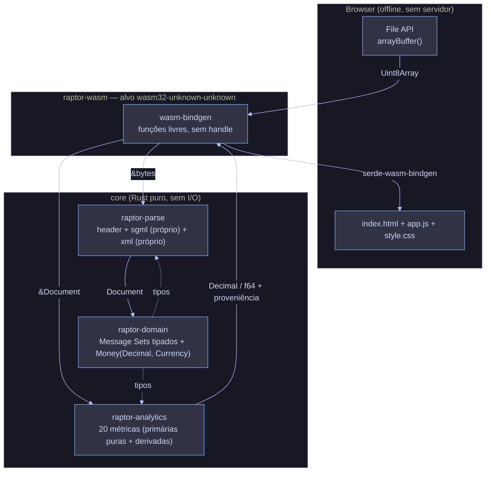
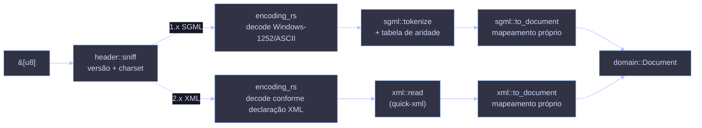
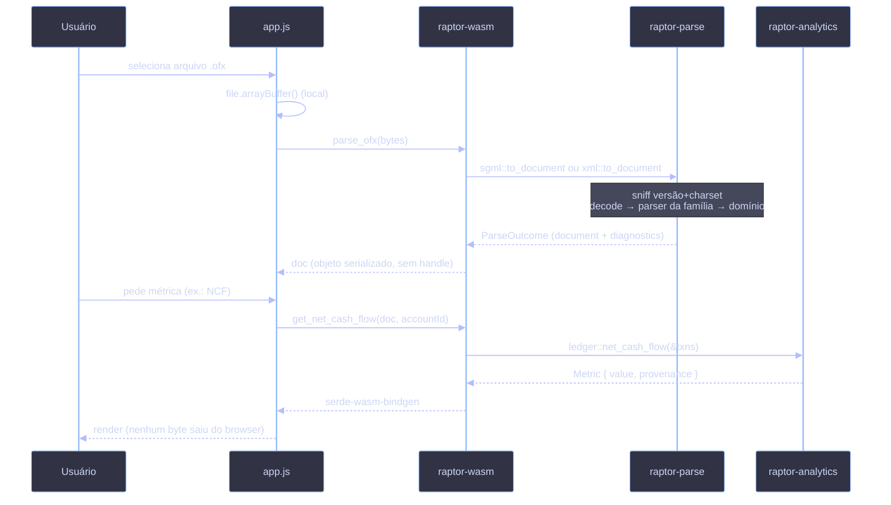
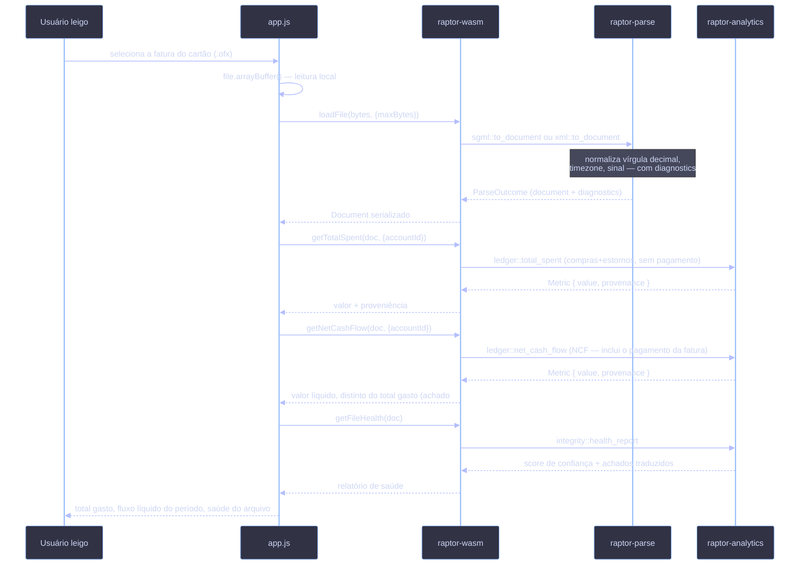
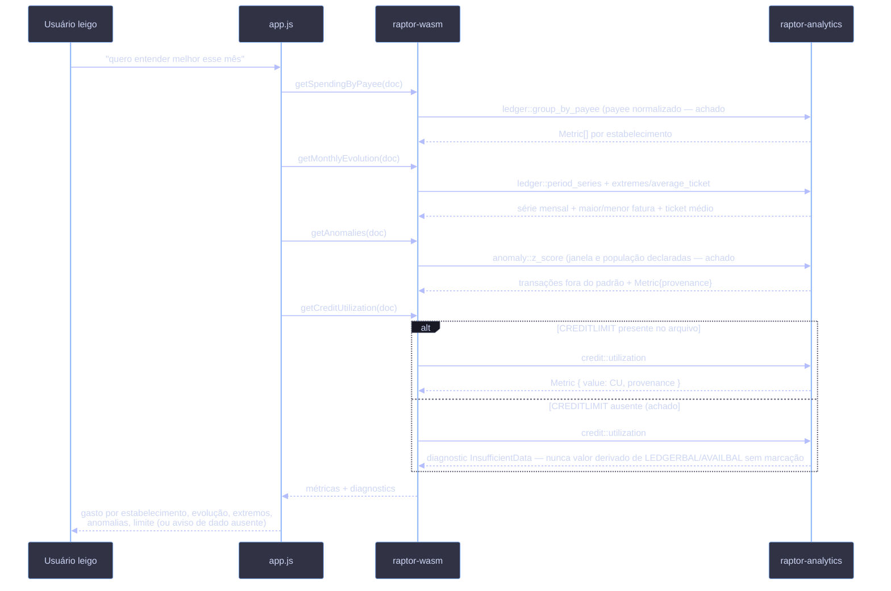
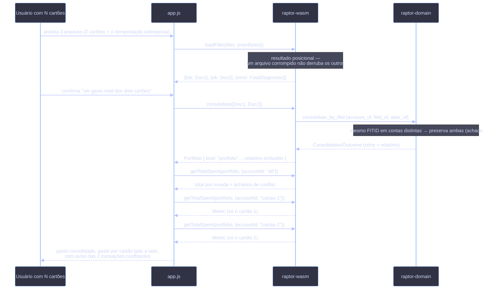
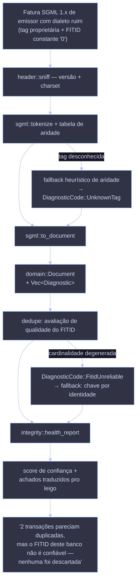
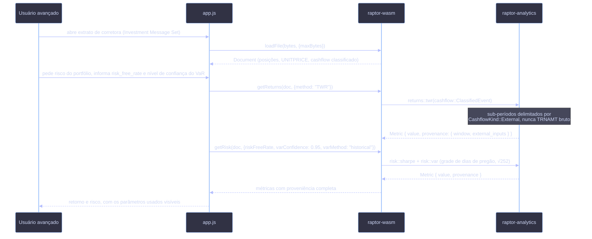
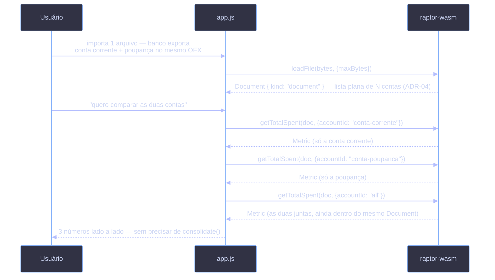
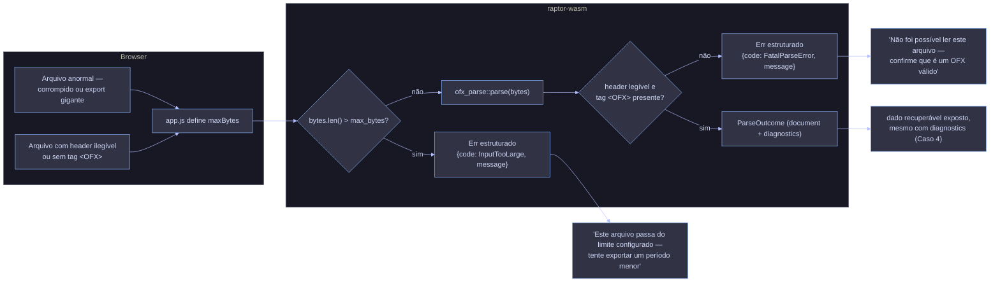

# Discovery / ADR — Biblioteca Rust OFX com Analytics e Alvo WASM

## Resumo executivo

Biblioteca Rust multi-crate (`domain`/`parse`/`analytics`/`wasm`) para parsing de todas as versões do protocolo OFX (SGML 1.x + XML 2.x), com 20 métricas de analytics financeiro e compilação para WASM — o objetivo final é uma página HTML que processa extrato bancário inteiramente no navegador, sem upload para servidor.

**Estado atual:** Discovery fechado — 13 ADRs + seção de Princípios de design (Hexagonal, DDD, SOLID, ROP/CQS — §5). Duas rodadas de auditoria (achados #1–25) totalmente fechadas: 7 em código real e testado, 18 como decisão vinculante para quando a crate correspondente existir. Duas rodadas de meta-auditoria estrutural do próprio documento (achados #26–40) e uma rodada de validação técnica (achados #41–47) já aplicadas. Terceira rodada — consistência pós-reversão de ADR-02/06, semântica de cálculo (dedupe, datas, grades de reamostragem) e realismo de dialeto/produto brasileiro (achados #48–85, três passadas) — aplicada nesta sessão; ver `analise-critica-adr.md`. Entrevista de fechamento resolveu as cinco decisões pendentes: #48 (`Diagnostic`/`DiagnosticCode` movem para `domain::diagnostic`), #51 (escopo consolidado particiona por moeda), #58 (licença trocada para MPL-2.0), #66 (mantido campo único de data em UTC — risco de deslocamento de mês em UTC−3 aceito conscientemente, não mitigado) e #76 (parcelamento modelado — campo `installment`, payee normalizado, visão dedicada; **revertido em 2026-07-27**, ver ADR-04: sem campo derivado, sem `open_installments`, `NAME`/`MEMO` seguem só como o spec OFX entrega). Nenhuma decisão de ADR segue pendente. `raptor-domain` é a única crate que existe: compila nativamente, 24 testes unitários + 5 doctests passam, `cargo clippy -- -D warnings` limpo.

**Auditoria de solução (33 achados, ótica CPO+CTO) integralmente resolvida** — achados em `auditoria-solucao.md`, todas as resoluções em `resolucao-auditoria.md` (R1–R7 + RA-5 a RA-32). Decisões operacionais que mudam o roadmap e a arquitetura, e que não aparecem em nenhum outro parágrafo deste resumo: **Nubank é o banco-piloto** do primeiro corte vertical do roadmap (não BB/Bradesco, cogitados originalmente por terem dialeto mais simples); a fronteira WASM roda dentro de um **Web Worker** (segunda revisão da ADR-06 nesta sessão, além da reversão do handle residente); estrutura de **GitHub (milestones/labels/issues)** adotada e formalizada em `roadmap-github.md` — os Épicos do roadmap reestruturado (vertical por valor, não mais horizontal por camada) substituem as Fases como milestones (ADR-12 revisada); **telemetria de produto vetada por princípio, para sempre, sem exceção nem anônima** (ADR-09); **drill-down até a transação individual** garantido via `Provenance` (ADR-05); Open Finance **deprioritizado** do horizonte ativo, foco 100% OFX por ora; `k_d` (módulo `credit`) definido como **Custo Implícito da Dívida** (`k_d = Σ I_paid / B̄_debt`), confirmado contra o handoff técnico original das 20 operações.

**Persona-alvo primária (ADR-13):** usuário leigo em finanças e tecnologia com cartão(ões) de crédito que exportam vários OFX por fatura/extrato. O produto prioriza análise de gasto de cartão — apartada por produto e consolidada — sobre métricas de investimento (que existem, mas ficam atrás de um modo avançado). Módulo de cálculo contábil chama-se `ledger`; há um módulo `integrity` dedicado à saúde dos arquivos importados.

**Decisões que mais mudam o resultado se ignoradas:** `Money` nunca soma entre moedas sem conversão explícita (achado #2); métricas de retorno (TWR/IRR/HPR/CAGR) consomem eventos de cashflow já classificados como capital externo ou performance, nunca `TRNAMT`/`BALAMT` bruto (achado #13 — o achado estrutural da segunda auditoria); `sgml`/`xml` são dois parsers independentes, cada um com mapeamento próprio pro domínio, sem AST neutro compartilhado (ADR-02, revertido nesta sessão); fronteira WASM não mantém handle residente — cada função de analytics recebe o documento serializado e desserializa internamente, sem `free()` nem gerência de ciclo de vida no JS — e roda dentro de um **Web Worker**, nunca na main thread (ADR-06, revertido e depois estendido nesta sessão — A#24 da auditoria de solução).

**O que falta:** `parse`, `analytics` e `wasm` — Fase 0 em diante do roadmap (§10). Primeira ação executável do próximo agente: `rustup target add wasm32-unknown-unknown` seguido de `cargo build --target wasm32-unknown-unknown -p raptor-domain`. Este sandbox não tem toolchain completo para validar isso (achado #43), mas já confirmou que a árvore de dependências de `domain` está limpa para o alvo (achado #41).

---

| Campo | Valor |
|---|---|
| Status | Revisado — achados críticos/altos da auditoria fechados (código testado ou decisão vinculante); status individual por ADR abaixo |
| Última atualização | 2026-07-21 |
| Escopo | Parsing multi-versão OFX + domínio tipado + analytics + fronteira WASM offline; também cobre princípios de design, decisões de processo/repositório (§5, ADR-10–12) e casos de uso de referência (§12) |
| Fora de escopo | FDX (JSON/REST), persistência, UI de produção, sincronização com instituições |
| Decisões cobertas | ADR-01 a ADR-13 + Princípios de design (§5) |

---

## Índice

**Seções:** 1. Contexto e problema · 2. Objetivos e não-objetivos · 3. Requisitos não-funcionais dirigentes · 4. Visão de arquitetura · 5. Princípios de design · 6. Decisões arquiteturais · 7. Fluxo de dados fim a fim · 8. Estratégia de testes e evals · 9. Riscos e mitigações · 10. Roadmap incremental · 11. Questões em aberto · 12. Casos de uso

**ADRs:** 01 Workspace multi-crate · 02 Dois parsers independentes (parsing) · 03 `Money` com moeda, nunca `f64` · 04 Domínio por Message Set (5 Message Sets) · 05 Analytics como funções puras (+ família derivada) · 06 Fronteira WASM (documento serializado, sem handle) · 07 Orçamento de binário WASM · 08 Erros e resiliência (diagnostics) · 09 Privacidade e offline · 10 Artefatos de repositório · 11 Artefatos de Claude Code · 12 Coordenação GitHub · 13 Produto: persona, escopos, saúde de arquivo, visões e API JS

---

## 1. Contexto e problema

O protocolo OFX carrega duas famílias sintáticas incompatíveis sob o mesmo nome: versões **1.0–1.6 em SGML** (tags folha sem fechamento, aridade definida por DTD, charsets legados como Windows-1252) e versões **2.0–2.3 em XML** bem-formado. Não existe biblioteca de referência oficial, e cada instituição emissora viola o spec de formas próprias. O ecossistema real (`LibOFX`, `ofx-rs`, `ofxgo`) trata parsing como problema central e frágil.

A necessidade é uma biblioteca única que (a) desserialize todas as versões para um domínio tipado comum, (b) exponha as 20 operações quantitativas consolidadas no handoff sobre essa estrutura, e (c) compile para WASM de modo que uma página estática processe extratos **100% client-side** — o arquivo do usuário nunca trafega para servidor. Privacidade e offline não são features: são a restrição arquitetural que define o projeto.

## 2. Objetivos e não-objetivos

Objetivos: cobertura completa das versões OFX; um único caminho de mapeamento para domínio independente do formato de origem; analytics como funções puras auditáveis; binário WASM enxuto executável offline; resiliência a arquivos legados malformados via parsing parcial com diagnostics.

Não-objetivos (nesta fase): FDX; escrita/geração de arquivos OFX; conexão OFX Direct com bancos; qualquer I/O de rede na crate core; UI além de uma demo de validação.

**Não-objetivo de posicionamento (R1, resolução da auditoria):** o projeto não compete no mercado de apps SaaS de finanças pessoais (Mobills, Organizze, Firefly III). Seu par de categoria é o tooling de formato — LibOFX, ofxtools, ofxparse —, e "roda local, sem serviço externo" é propriedade herdada dessa categoria, não uma proposta de valor a validar contra o mercado de apps. Isso reenquadra (não invalida) a persona leiga da ADR-13: ela segue sendo o alvo da demo de referência e do design de UX, mas como *um* consumidor da lib entre outros — o produto é a lib + tooling, não o app.

## 3. Requisitos não-funcionais dirigentes

Privacidade por construção — a crate core não tem dependência de rede e a fronteira WASM não expõe `fetch`. Determinismo — mesmo input produz mesmo output (idempotência de parsing e de analytics, satisfeita por pureza) — inclusive na serialização: agregações agrupadas (por payee, por moeda) saem em coleções ordenadas (`BTreeMap` ou sort estável), nunca `HashMap` serializado, para que golden tests da saída byte a byte sejam possíveis (achado #82). **[A#26 da auditoria de solução, fechado como decisão — confirmado pelo autor: determinismo com tolerância para f64]** *(Achado da auditoria de solução, não relacionado a nenhum achado #N desta ADR.)* Essa garantia é byte a byte para `Decimal`/`Money` (achado #56) mas não para métricas que usam `f64` (Sharpe, VaR, volatilidade, EMA) — ponto flutuante não é associativo, e a ordem de redução pode variar entre execuções sem que isso seja um bug. Determinismo pra essas métricas significa **dentro de tolerância explícita (epsilon)**, não igualdade bit-a-bit; §8 especifica a tolerância por métrica nos testes fortes. Auditabilidade — cada métrica retorna, além do valor, os metadados de proveniência (janela temporal, contagem e origem dos inputs). Exatidão financeira — nenhuma soma monetária em ponto flutuante, nem entre moedas distintas sem conversão explícita. Evolução incremental — front-ends de formato plugáveis sem tocar o domínio.

---

## 4. Visão de arquitetura

Workspace Rust multi-crate, uma crate por responsabilidade conceitual. A crate de fronteira se chama **`wasm`**, não `bindings` — nome trocado por confirmação do usuário: `bindings` era mais neutro (sobreviveria a um alvo C ABI hipotético futuro), mas `wasm` é mais honesto sobre o que existe *hoje* e mais legível pra quem abre o repo pela primeira vez. Se um alvo não-WASM aparecer de verdade, é um crate novo (`ffi` ou similar) ao lado, não uma corrida pra renomear `wasm` — o custo de errar essa aposta é baixo (é `git mv` + atualizar imports), o custo de um nome genérico demais hoje é confusão real toda vez que alguém lê o repo.



Grafo de dependências entre crates (acíclico): `parse → domain`, `analytics → domain`, `wasm → {parse, analytics, domain}`. `domain` não depende de ninguém, o que a mantém como núcleo estável.

**[Achado #48 fechado como decisão — confirmado pelo autor]** Os tipos `Diagnostic`/`DiagnosticCode` moram em `domain::diagnostic`, não em `parse`. `parse` é o produtor primário e os reexporta; `integrity` (em `analytics`) é consumidor. É o que mantém o grafo acíclico com `integrity` dentro de `analytics`: sem essa decisão, `analytics` dependeria de `parse` — aresta que o grafo declarado acima nunca previu. Consequência prática: o enum é versionado junto da API pública de `domain`, não de `parse` (ajusta o fechamento do achado #17 na ADR-08).

### Layout do workspace

```
raptor/
├── Cargo.toml                    # [workspace] + perfil release WASM
├── crates/
│   ├── domain/                   # raptor-domain — núcleo estável (implementado, Fase −1)
│   │   └── src/{lib,money,metric,cashflow,predictive,dedupe,consolidation,diagnostic}.rs
│   │       # cashflow/predictive/dedupe nascem aqui por serem baratos e
│   │       # não terem crate `analytics` para morar ainda na Fase −1;
│   │       # `analytics` pode reexportar ou promover cashflow/predictive
│   │       # quando existir (Fase 3/4) — decisão adiada, não perdida.
│   ├── parse/                    # raptor-parse
│   │   └── src/{lib,header}.rs + sgml/{tokenize,to_document}.rs + xml/{read,to_document}.rs
│   ├── analytics/                # raptor-analytics
│   │   └── src/{lib,ledger,credit,anomaly,returns,risk,trend,integrity}.rs
│   └── wasm/                     # raptor-wasm — produz o .wasm
│       └── src/lib.rs
├── web/                          # demo de validação
│   └── {index.html,app.js,style.css}
└── corpus/                       # golden files sintéticos por versão/dialeto (achado #4)
```

---

## 5. Princípios de design

As decisões abaixo (ADR-01 a ADR-12) já seguem os princípios desta seção na prática; o objetivo aqui é nomeá-los — o nome vira regra verificável em vez de intuição a ser redescoberta a cada métrica ou Message Set novo.

**Hexagonal (Ports & Adapters).** `wasm` é o Primary Adapter, `domain`/`parse`/`analytics` é o core, `&[u8]`/`serde-wasm-bindgen` é o contrato de borda (ADR-01, ADR-06) — hexagonal na estrutura desde o início, sem o vocabulário. A regra que isso torna explícita: **capacidade externa do core entra como trait (Secondary Port) injetada pela borda, nunca como chamada direta nem `#[cfg(target_arch)]` dentro do core.** Hoje o core não precisa de nenhum port porque recebe `&[u8]` já lido — mas a regra já vale para quando alguma capacidade de plataforma se tornar necessária (ex.: relógio, se `DY` precisar saber "quando é agora"; leitura de múltiplas fontes, se a consolidação do §11 precisar). **Deliberadamente não nomeio a forma exata dessas traits aqui** — fixar nome e assinatura de um port antes de a capacidade ser implementada ancora a Fase 0 numa abstração que pode não bater com a necessidade real; a regra é o princípio (injeção, não chamada direta), a forma nasce quando o código nascer. Esses Ports podem ser `async` na implementação de borda (I/O local via File API/`fetch`/`IndexedDB` é assíncrono no browser por natureza) sem o core se acoplar a nenhuma runtime — e sem assumir `Send + Sync` nas Futures, porque o executor WASM é single-thread (`spawn_local`); assumir `Send` seria a falsa expectativa de concorrência que a runtime da borda não tem.

**DDD (Domain-Driven Design).** `Document` (ADR-04) é candidato a Aggregate Root — mas o rótulo é aspiracional, não conquistado: o que faz algo ser Aggregate Root de verdade em DDD não é o nome, é o **enforcement** (todo acesso/mutação passa pela raiz, nunca direto numa entidade filha). Isso ainda não está desenhado, porque `Transaction`/`Account` não existem em código (são Fase 0). Registro a intenção aqui — a invariante `saldo_inicial + Σ transações == saldo_final` (§8) só é invariante de agregado de fato se `Document` for a única porta de acesso — mas a Fase 0 precisa decidir se aceita esse enforcement (ex.: `Account`/`Transaction` sem construtor público fora de `Document`) ou se abre acesso direto por conveniência, caso em que o nome correto é só "objeto raiz", sem a garantia que "Aggregate Root" promete em DDD. A classificação de cashflow (achado #13, `raptor-domain::cashflow`) é um Domain Service: conhecimento de negócio sobre o significado de um lançamento, não cálculo estatístico — por isso mora no domínio, não em `analytics`. Nomenclatura vem do Ubiquitous Language do próprio spec OFX (`TRNAMT`, `INVPOS`, Message Set), não de sinônimos inventados.

**SOLID.** SRP já vale na separação de crates e no isolamento `sgml`/`xml` (ADR-02, revertida de AST neutro para dois parsers independentes — cada família de formato tem uma única razão pra mudar, não mistura tokenização com regra de negócio de outra família). OCP fica mais fraco depois dessa reversão: com dois parsers independentes, um front-end de formato novo (FDX futuro) não altera o parser existente, mas também não reusa o mapeamento — extensão sem modificação, só que com duplicação em vez de reuso; o trade-off explícito na ADR-02. **Não é LSP** o que explica o achado #7, ao reler com mais cuidado — LSP é sobre substituibilidade de subtipo dentro de uma hierarquia real (trait/interface compartilhada), e `runway`/`burn_rate` não estão nessa relação: são duas funções livres com assinatura diferente, sem trait comum que uma violaria ao ter forma distinta. O que de fato explica o achado #7 é mais simples e não precisa de nome de princípio SOLID: forçar uma forma de assinatura uniforme quando a semântica dos dados de entrada difere (dados brutos vs. resultado de outra métrica) é o tipo de generalização prematura que produz o próprio bug de modelagem — sem precisar emprestar vocabulário de LSP pra isso. ISP rege os Ports futuros da regra Hexagonal acima: traits pequenas e separadas, nunca uma `Environment` monolítica — a forma exata de cada port fica pra quando a capacidade for de fato necessária (a §5 não fixa nomes específicos além do padrão do que já existe). DIP é a mesma regra dita de outro ângulo: o core depende de abstrações, nunca o inverso — e `#[cfg(target_arch)]` no core é a violação mais provável de acontecer sem ninguém perceber.

**ROP e CQS.** `Result` + `?` + combinadores (`try_add`, `sum_homogeneous`, `runway`) já é o padrão de fluxo de erro do domínio. Toda métrica de `analytics` é query pura — CQS bem-comportado; quando cache local existir, comandos (escrever cache) entram separados das queries (computar métrica), não fundidos na mesma função.

**Padrões GoF com uso real.** Newtype (`Money`, `CurrencyCode`, `Fitid`) com a convenção: `From`/`Into` para conversão infalível, `TryFrom`/`TryInto` para falível — vale para os newtypes que `parse`/`wasm` ainda vão criar a partir de string bruta. Strategy é esticado demais como está: a política de reamostragem do achado #16 e os `Formatter` de saída são hoje só **decisão documentada**, não um objeto de estratégia intercambiável em runtime (não existe trait `ResamplingStrategy` com duas implementações trocáveis) — chamar isso de "padrão Strategy" empresta peso de design pattern pra uma configuração fixa. Vira Strategy de verdade só se/quando existir mais de uma implementação intercambiável em runtime (ex.: se a reamostragem precisar ser plugável por usuário avançado) — até lá, é só política, não pattern. Facade é o próprio módulo `wasm` — funções livres (`parse_ofx`, `get_net_cash_flow` etc., ADR-06) escondendo a complexidade de `parse`+`analytics`+`domain` atrás de uma API simples; Facade não exige um `struct` único, um conjunto de funções organizadas cumpre o mesmo papel — o que mudou com a reversão do handle opaco foi a forma da fachada, não sua existência.

**Convenções de código decorrentes.** `#[derive(Debug, Clone, PartialEq, Eq, Hash)]` em Value Objects, exceto quando carregam `f64` (não deriva `Eq`/`Hash`, só `PartialEq`) — relevante para os tipos de `analytics` com volatilidade/Sharpe. Doctests (`cargo test --doc`) na API pública de `domain`, já que ali `domain` é o contrato que `parse`/`analytics`/`wasm` consomem. `println!`/`eprintln!` proibidos no core — a proveniência em `Metric` (ADR-05) já é o canal de auditoria; texto solto em stdout não é. **Verificado**: no alvo `wasm32-unknown-unknown`, `println!` não é só deselegante, é literalmente descartado em silêncio (a doc oficial do target confirma: sem host importado, `println!` não escreve em lugar nenhum, sem erro nem efeito) — a regra não é só estilo, é a diferença entre ver o diagnóstico e perdê-lo sem aviso. **Feature flags de dependências do core auditadas contra o alvo `wasm32` antes de virarem hábito** (achado #41) — `chrono` com feature `clock` compila normal nativamente mas passa a depender de `wasm-bindgen`/`js-sys` no alvo wasm32 (chrono usa a Date API do JS para hora real), o que violaria a regra Hexagonal deste mesmo parágrafo se `domain` só precisa de `NaiveDate` e nunca de hora real. A regra geral: habilitar uma feature de crate no `core` exige perguntar não só "compila nativamente?" mas "essa feature específica introduz dependência de plataforma no alvo wasm32?" — a resposta não é óbvia pelo nome da feature.

---

## 6. Decisões arquiteturais

### ADR-01 — Workspace multi-crate vs. crate único com módulos

**[Status: revisado — achados #12/#24 fechados]** Decisão: **workspace multi-crate**. A separação em `domain`/`parse`/`analytics`/`wasm` materializa a fronteira de escopo em fronteira de compilação, permite feature flags e `default-features = false` por consumidor (a demo WASM não precisa arrastar dependências de teste), e força o grafo acíclico. `domain` sem dependências é reusável por front-ends futuros (FDX) sem acoplar parsing.

Trade-off: overhead de coordenação de versões entre crates e tempo de build incremental levemente maior. Aceitável frente ao ganho de controle de dependência transitiva no binário WASM, onde cada crate arrastada custa bytes. A separação em crates é também o que torna a arquitetura Hexagonal na prática — ver §5 para a regra de Secondary Ports que isso habilita.

**[Achados #12/#24 fechados como decisão — suavizado]** Política de versionamento: todo o workspace fica em `0.x` (pré-1.0) pelo menos até a Fase 5 (`wasm` existir e ter contrato JS pra avaliar) — mas a Fase 5 é quando fica **possível** considerar 1.0, não um compromisso automático de fazê-lo ali. Projeto pessoal pode legitimamente ficar em 0.x por muito mais tempo que isso, mantendo liberdade de quebrar API sem o peso simbólico de major version bump; nenhuma pressão pra "promover" a versão só porque a Fase 5 terminou. Superfície pública mínima por crate: `domain` expõe só os tipos e funções necessários para `parse`/`analytics`/`wasm` consumirem (`pub(crate)` é o padrão, `pub` é exceção justificada); a fronteira `pub` de `wasm` é o contrato realmente externo (consumido por JS) e é o candidato natural a estabilizar primeiro, quando/se 1.0 for decidido.

### ADR-02 — Estratégia de parsing: dois parsers independentes por família de formato

**[Status: revisado outra vez — decisão trocada de (C) para (B), por confirmação do usuário]** Três caminhos considerados: (A) converter SGML 1.x para XML canônico e ter um único desserializador XML; (B) dois parsers totalmente independentes, cada um mapeando direto para `domain`; (C) ambos os formatos produzem uma árvore de elementos neutra consumida por um único mapeador `AST → domínio`.

Decisão: **(B)**. A versão original deste Discovery escolhia (C) pelo argumento de OCP — um mapeador único evita duplicar conhecimento de negócio quando um formato novo aparecer. Revertido: o custo de (C) era acoplar as duas famílias por uma camada intermediária que nenhuma delas pedia — SGML 1.x e XML 2.x são estruturalmente distintos o bastante (aridade implícita vs. explícita, charset variável vs. UTF-8 fixo) que forçar os dois pela mesma árvore neutra escondia a diferença real em vez de simplificar. Com (B), `sgml::to_document` e `xml::to_document` são dois caminhos completos e independentes, cada um dono do próprio mapeamento para `domain` — mais fácil de testar e depurar isolado (um bug no tokenizer SGML não arrisca o caminho XML), ao custo real e consciente de duplicar a lógica de mapeamento das tags comuns aos dois formatos (`TRNAMT`, `DTPOSTED`, `FITID` são interpretados duas vezes, uma por parser).



O tokenizer SGML resolve o fechamento implícito de tags folha consultando uma **tabela de aridade** — conhecimento estático de quais tags são agregações vs. folhas, extraído das DTDs 1.x. A recepção em `&[u8]` (não `String`) é obrigatória: o charset só é conhecido após ler o header, e OFX 1.x usa `CHARSET:1252` com frequência. `encoding_rs` roda em WASM.

**[Achado #79 fechado como decisão]** O caminho 2.x não presume UTF-8: honra o encoding da declaração XML via `encoding_rs` (dependência já presente no caminho 1.x), emitindo diagnostic da família "correção aplicada" quando divergir do spec (que manda UTF-8); BOM é consumido antes do sniff. Emissores reais — inclusive brasileiros — declaram ISO-8859-1 em arquivos 2.x; decode fixo produziria mojibake em payee acentuado ou falha de parse, contradizendo o ADR-08.

Trade-off: manter a tabela de aridade é custo recorrente conforme surgem dialetos — e sem AST neutro pra amortizar, esse custo fica isolado no módulo `sgml`, que é o ponto: um dialeto SGML estranho não arrisca o parser XML. Mitigado pelo corpus de golden files (ADR-08) e por cada mapeador ser tolerante a tags desconhecidas (ignora com diagnostic em vez de abortar). **Duplicação de mapeamento entre `sgml`/`xml` é aceita conscientemente** — se um terceiro formato aparecer (FDX, §11), a pergunta "um AST neutro valeria a pena com 3 formatos" pode ser reaberta; com 2, o custo de duplicação é menor que o custo de acoplamento. A deriva entre as duas cópias é detectada pelos testes de paridade do §8 (achado #55) — pares equivalentes 1.x/2.x do corpus devem produzir o mesmo `Document`.

**[Achado #25 fechado como decisão]** Tags fora da tabela de aridade (extensões proprietárias tipo `<INTU.BID>`) não abortam o tokenizer SGML. Heurística de fallback: aridade é inferida em runtime pela forma do stream — se aparece uma tag de fechamento correspondente antes da próxima tag do mesmo nível, é agregação; senão, é folha. A inferência emite `DiagnosticCode::UnknownTag` para o consumidor saber que a aridade daquela tag foi adivinhada, não lida da DTD. O corpus de golden files (gerado por dialeto, achado #4) inclui pelo menos um caso de tag proprietária para exercitar esse caminho.

### ADR-03 — Representação monetária: `Decimal` com moeda obrigatória, nunca `f64`

**[Status: revisado — achado #2 fechado em código]** Decisão: `Money { amount: rust_decimal::Decimal, currency: CurrencyCode }` em `domain::money`, já implementado e testado. Valores OFX chegam como strings decimais (`<TRNAMT>-123.45`); `Decimal` parseia sem perda e todas as agregações financeiras (NCF, saldos, ADB) são exatas. A versão original desta decisão previa só `Money(Decimal)` sem moeda — a auditoria apontou que isso permitia `analytics::aggregation` somar `TRNAMT` de contas em moedas diferentes (`CURDEF`/`CURSYM`) com resultado numericamente exato e financeiramente incorreto, sem erro nem diagnostic. `Money` agora não implementa `std::ops::Add`: soma passa por `try_add`/`sum_homogeneous`, que retornam `Err(CurrencyMismatch)` em moeda divergente — a checagem é obrigatória no call-site, não um operador que pode ser usado sem pensar. Ponto flutuante continua proibido para dinheiro por invariante de domínio.

A fronteira com estatística é explícita: métricas que exigem `f64` (volatilidade, Sharpe, VaR, EMA) convertem **no ponto de cálculo**, nunca no armazenamento nem em agregações exatas. Essa divisão é documentada em `analytics` e coberta por teste.

Trade-off: `rust_decimal` adiciona ~alguns KB ao WASM. Alternativa avaliada — inteiro de unidades mínimas (`i64` de centavos com escala) — reduz tamanho mas empurra escala e arredondamento para o call-site e complica ativos com mais casas decimais (`UNITPRICE`). **Escolhido `Decimal` por padrão, confirmado pelo usuário** — cobre `Money` e `UNITPRICE` no mesmo tipo, sem precisar de um segundo esquema de escala pra investimento. Condição explícita de revisão: só reabrir esta decisão se a medição real de binário na Fase 5 (achado #43 — não medível neste sandbox) mostrar que `rust_decimal` é uma fração significativa do orçamento de tamanho; não é decisão especulativa a antecipar sem dado.

### ADR-04 — Modelagem de domínio por Message Set

**[Status: revisado outra vez — achado #3 reaberto e refechado]** `domain` cobre os cinco Message Sets do protocolo: **Banking, Credit Card, Investments, Bill Payment e Taxes**, desde a Fase 0. A auditoria original (achado #3) apontou que Bill Payment/Taxes estavam ausentes do layout e do roadmap sem decisão explícita; a correção que apliquei então foi cortá-los do MVP — mas isso contradizia o pedido original ("domínio com todas as estruturas de dados"), e a correção certa de uma omissão é completar, não excluir. Revertido: os cinco entram juntos, mesmo padrão de arquivo por Message Set (`banking.rs`/`creditcard.rs`/`investment.rs`/`billpay.rs`/`taxes.rs`), sem mudança de arquitetura — o layout do workspace já previa isso, só o roadmap e o "fora de escopo" do header precisavam alinhar (corrigidos).

**[A#5 da auditoria de solução, fechado como decisão — confirmado pelo autor: Bill Pay e Taxes ganham visão leiga]** *(Achado da auditoria de solução, não relacionado a nenhum achado #N desta ADR.)* Modelar os cinco Message Sets sem que a persona leiga usasse Bill Pay/Taxes era escopo sem valor de usuário imediato. Resolvido dando propósito, não cortando: Bill Pay alimenta a visão "Contas agendadas" (ADR-13) quando o banco popula o bloco — candidato real, ligado à recorrência (R2). Taxes é mais incerto: o Message Set foi desenhado em torno de formulários fiscais americanos (1099), e bancos brasileiros provavelmente não o populam — a declaração de IR no Brasil usa documentos sem relação com esse bloco do OFX. Antes de qualquer visão sobre Taxes, um spike de pesquisa confirma (ou descarta) se algum banco do corpus o popula; se não, o Message Set continua modelado por completude do spec, sem visão associada — resultado esperado de verificar antes de prometer, não fracasso da decisão.

Estruturas tipadas para conta (`AccountId`, tipo, instituição), transação (`TRNAMT`, `TRNTYPE`, `DTPOSTED`, `FITID`), saldo (`BALAMT`, `DTASOF`) e posição de investimento (`UNITPRICE`, `UNITS`, `INVPOS`). Enums fechados para `TRNTYPE` com variante `Unknown(String)` para tolerar valores fora do spec sem perder o dado bruto. O documento carrega também a janela declarada da lista de transações (`DTSTART`/`DTEND`) — é o que permite ao `integrity` distinguir "mês sem gasto" de "arquivo faltando" (achado #80), e entra na proveniência de qualquer métrica de período.

**[Achado #76 revertido — decisão do autor, 2026-07-27]** O campo `installment` foi descartado. `Transaction` não carrega parcelamento derivado — `NAME`/`MEMO` permanecem exatamente como o spec OFX entrega, sem heurística de reconhecimento de marcador de parcela (`"PARC 02/10"`, `"3/12"` etc.) no mapeamento de nenhum parser. Consequência aceita conscientemente: `group_by_payee` fragmenta o mesmo estabelecimento por parcela quando o emissor varia o `NAME`/`MEMO` por parcela, e `anomaly::z_score` compara parcela contra compra à vista sem agregação — os dois problemas que o achado #76 original tentava resolver ficam sem mitigação estrutural. `ledger::open_installments` sai de escopo por completo: não há dado estruturado de parcela para agregar (histórico do achado, ver `docs/alinhamento-issues.md`).

Invariantes explícitas no construtor: transação exige `FITID` e `DTPOSTED`; posição exige `UNITPRICE` e `UNITS` coerentes com `INVPOS`. A ausência estrutural de subordinação hierárquica de cartões adicionais e de segregação PF/PJ (limite conhecido do OFX, item 06 do handoff) é modelada como lista plana de contas — não se inventa hierarquia que o protocolo não carrega. Em termos de DDD (§5, revisado): `Document` é candidato a Aggregate Root — vira isso de fato só se a Fase 0 desenhar o enforcement (acesso exclusivo pela raiz), não automaticamente pelo nome.

**[Achado #10 fechado em código — revisado pelos achados #53/#65/#77]** Reimportação de extratos sobrepostos pode repetir `FITID`. `raptor-domain::dedupe` já implementa e testa `dedupe_by_fitid`, mas a semântica evoluiu em três pontos, tratados como pacote único de mudança no mesmo código já testado:

- **Chave de deduplicação é `(AccountId, Fitid)`, nunca `Fitid` puro** (achado #65) — no spec OFX a unicidade de `FITID` tem escopo de conta emissora; entre contas distintas, `FITID` igual são transações distintas, jamais deduplicadas. `dedupe_by_fitid`/`consolidate_by_fitid` ganham extrator `account_of`. Casos gêmeos obrigatórios: mesmo `FITID` em contas distintas **deve** preservar ambas; mesmo `FITID` na mesma conta entre fontes **deve** deduplicar. Sem isto, o escopo consolidado da ADR-13 subconta o gasto silenciosamente com emissores de `FITID` sequencial curto.
- **Avaliação de qualidade da chave antes de usá-la** (achado #77) — distribuição degenerada por fonte (cardinalidade muito menor que a contagem de transações, valores vazios ou constantes — "0" para tudo é defeito notório de emissor) gera `DiagnosticCode::FitidUnreliable` e fallback de chave por identidade (hash de data+valor+payee) ou dedupe desativado para aquela fonte, registrado na proveniência da consolidação. Sem isto, um extrato de emissor ruim colapsa para uma transação e o `integrity` reporta o desastre como "duplicatas removidas".
- **Payload comparado, não só a chave** (achado #53) — em `FITID` repetido (dentro da mesma conta), o payload das ocorrências é comparado: idêntico → cópia, descartada e reportada como `DuplicateFitid` (comportamento atual); divergente (valor, data ou tipo diferem) → conflito real, não cópia — a precedência cronológica ainda escolhe qual ocorrência fica, mas o descarte é reportado como `DiagnosticCode::FitidConflicting`, família "exigem atenção" (achado #17), nunca silenciosamente como duplicata. `integrity` traduz o conflito pro leigo ("uma transação aparece com valores diferentes em duas faturas").

O `Transaction` real desta ADR só precisa carregar `AccountId` e `Fitid` para os três utilitários funcionarem; nenhuma mudança de modelo necessária quando `Transaction` for escrito na Fase 0. Testes atualizados com os três pares de casos gêmeos (idêntico vs. divergente; preserva entre contas vs. deduplica na mesma conta; `FITID` constante → `FitidUnreliable` sem colapso).

**Consolidação multi-fonte — fecha a metade mecânica da questão em aberto do §11.** Analytics de portfólio (`w_i`, Sharpe, VaR) e reimportação de contas/faturas diferentes exigem combinar N fontes numa única série antes de qualquer `Metric`. `raptor-domain::consolidation::consolidate_by_fitid` (implementado e testado) recebe `Vec<(SourceLabel, Vec<T>)>` mais extratores `fitid_of`, `date_of` e `account_of` (achado #65 — a chave de deduplicação é `(AccountId, Fitid)`, nunca `Fitid` puro; cada fonte passa por avaliação de qualidade da chave antes do dedupe, achado #77), e devolve uma série **ordenada cronologicamente** com duplicata de `FITID` removida entre fontes. Regra de precedência: em `FITID` repetido, vence a ocorrência de **data mais antiga** — é o registro original; a reimportação posterior é a cópia, descartada e reportada em `DuplicateFitid`. Empate de data desempata pela ordem de `sources` (estável), então passar a fonte mais confiável primeiro ainda importa nesse caso de borda. A saída sai ordenada por data crescente — série pronta para analytics de janela (TWR, MDD, σ dependem dessa ordem), sem o chamador reordenar. `ConsolidationOutcome::sources` alimenta `ExternalInput::ConsolidatedFrom` (achado #14) quando uma `Metric` de portfólio é calculada sobre o resultado — a proveniência registra de quais fontes os dados vieram. O `ConsolidationOutcome` é exatamente o objeto que a fronteira serializa como `Portfolio` na ADR-13 — mesma estrutura, dois nomes por camada (Rust/JS); o relatório de consolidação (`duplicates_removed`, `conflicts`, `sources`) viaja dentro dele, não numa função separada de consulta (achados #63/#49).

O que isto **não** decide, porque pertence a outra camada: como as fontes são lidas (é um Secondary Port de I/O local, §5 — Hexagonal, forma exata deliberadamente não fixada ainda). A política de acionamento (mecanismo na lib, chamada sempre explícita do consumidor, nunca automática) está fechada na ADR-13.

**[Achado #51 fechado como decisão — confirmado pelo autor] Multi-moeda na consolidação.** `consolidate_by_fitid` particiona a saída por `CurrencyCode` — nunca soma nem converte entre moedas (não existe fonte de câmbio offline, e ADR-09 impede buscá-la; conversão automática é estruturalmente impossível neste projeto). `ConsolidationOutcome` carrega uma série por moeda; toda visão consolidada da ADR-13 renderiza um bloco por moeda ("Total: R$ X · US$ Y"); `integrity` reporta a presença de múltiplas moedas. É a metade de produto do achado #2: lá o domínio recusa a soma; aqui o produto define o que mostrar no lugar dela.

### ADR-05 — Analytics como funções puras sobre o domínio

**[Status: revisado — achado #7 fechado]** A premissa original era "toda métrica é `fn(&[T]) -> Metric<V>`, sem estado nem I/O". Isso vale para a família **primária** (`ledger`, `credit`, `anomaly`, `returns`, `risk`, `trend`), mas não para a família **derivada** — métricas que consomem o resultado de outra métrica em vez de dados brutos. `predictive::runway` (`raptor-domain`, já implementado e testado) é o primeiro caso: `fn(Money, &Metric<Money>) -> Metric<Decimal>`. As duas famílias coexistem deliberadamente; forçar Runway na assinatura primária era o próprio bug de modelagem — em termos de LSP (§5), seria forçar um subtipo num contrato que ele não satisfaz.

O retorno não é o valor cru: é `Metric { value, provenance }`, onde `provenance` carrega janela temporal, contagem de inputs, faixa de datas e — desde o fechamento do achado #14 — os inputs externos usados (`ExternalInput`, já implementado em `raptor-domain::metric`). Pureza (na família primária) garante idempotência e testabilidade direta.

**[A#22 da auditoria de solução, fechado como decisão — confirmado pelo autor: prioridade alta, drill-down até a transação]** *(Achado da auditoria de solução, não relacionado a nenhum achado #N desta ADR.)* Sem uma lista de quais transações compuseram um número, não existe drill-down possível em lugar nenhum da UI — e a confiança da persona leiga é binária: o primeiro número que ela achar "errado" (transferência mal-classificada, parcela mal interpretada) destrói a confiança em todos os outros, sem meio de investigar o porquê. Decisão: `Provenance` ganha um acessor opcional para a lista de `(AccountId, Fitid)` (chave do achado #65) das transações que entraram no cálculo — não como obrigação de toda métrica (uma agregação sobre milhares de transações não precisa listar todas), mas como capacidade que `ledger::total_spent`/`extremes`/`group_by_payee` — as métricas mais prováveis de gerar dúvida da persona leiga — devem expor. Prioridade alta, Milestone 4 do roadmap.

Duas métricas concentram a complexidade algorítmica e recebem tratamento próprio: **IRR/XIRR** usa solver iterativo (Newton-Raphson com fallback para bissecção em bounds), retornando diagnostic de não-convergência em vez de `NaN`; **TWR** exige sub-períodos delimitados por fluxos de caixa externos — e desde o fechamento do achado #13, esses fluxos vêm pré-classificados por `raptor-domain::cashflow` (`CashflowKind::External` marca a quebra de sub-período), não inferidos ad-hoc dentro de `returns`. As demais são agregações ou estatísticas de janela deslizante diretas.

**[Achado #16 fechado como decisão — corrigido; grade refinada pelo achado #67]** Frequência de reamostragem: a grade acompanha o fator de anualização, não o contrário. Série de investimento (`UNITPRICE`) é reamostrada para grade de **dias de pregão**, sem preencher fim de semana — coerente com o fator `√252` (dias úteis de mercado), convenção de trading que vale só para `risk`/`returns` sobre investimento (modo avançado, ADR-13). Série de gasto/saldo (`BALAMT`, o caminho principal da persona-alvo) é reamostrada para grade de **calendário** — todo dia, fim de semana incluso — coerente com o fator **`√365`**; reamostrar investimento pra grade de calendário e anualizar com `√252` deflaciona σ com dias de retorno zero, o erro simétrico ao que este achado já corrigiu no sentido inverso. Grade mensal é sempre derivada da grade base (diária de pregão ou de calendário), nunca calculada direto de pontos irregulares. Política de preenchimento explícita (forward-fill para saldo — saldo persiste entre lançamentos); contagem de pontos preenchidos entra na proveniência. Cada módulo registra o fator e a grade que de fato usa via `ExternalInput::Horizon` na proveniência — não existe uma constante global `√252` compartilhada entre os dois contextos. O span da EMA é parametrizado (nunca uma constante `α` fixa) e também entra na proveniência.

Mapa das 20 operações para os módulos — atualizado com o módulo `predictive` (achado #1 fechado; antes 18/20 mapeadas, faltavam BR e Runway) e com a renomeação `aggregation`→`ledger` da ADR-13:

| Módulo | Métricas |
|---|---|
| `ledger` | NCF, ADB, AT + agregações contábeis da persona leiga (total gasto, série por período, gasto por estabelecimento, extremos) — ver ADR-13; agregações de gasto consomem eventos classificados/filtrados por `TRNTYPE`, nunca `TRNAMT` bruto (achado #52) |
| `credit` | CU, k_d — **Custo Implícito da Dívida**: `k_d = Σ I_paid / B̄_debt` (juros pagos sobre saldo médio em dívida — TRNAMT com TRNTYPE=INT, BALAMT). Confirmado contra o handoff técnico original das 20 operações (A#15 fechado — ver `resolucao-auditoria.md`, RA-15). **Ressalva de dialeto, para a Fase 2 (Credit Card):** não está confirmado que emissores brasileiros usam `TRNTYPE=INT` para juros de rotativo/encargos financeiros — pode ser necessário derivar de `FEE`/`SRVCHG` ou de padrão textual em `NAME`/`MEMO` (ex.: "JUROS ROTATIVO", "ENCARGOS"), no mesmo espírito da normalização de dialeto já aplicada a outras tags (achados #6/#18). Não bloqueia o Discovery; verificação entra no corpus da Fase 2. |
| `anomaly` | Z-Score de despesas — opera sobre o valor de cada transação (`TRNAMT`); achado #76 revertido, sem agregação de parcelas (spec OFX não carrega parcelamento estruturado) |
| `returns` | HPR, TWR, IRR/XIRR, CAGR, DY |
| `risk` | σ (volatilidade), Sharpe, MDD, VaR, w_i (peso no portfólio) |
| `trend` | SMA, EMA |
| `predictive` | BR (Taxa de Queima), Runway (Pista de Sobrevivência) — família derivada; implementado hoje em `raptor-domain` (ver §4) |
| `integrity` | Relatório de saúde dos arquivos importados — não é métrica financeira, ver ADR-13 |

**[Achado #69 fechado como decisão]** ADB e toda métrica sobre `BALAMT` operam sobre série de saldo **reconstruída** — OFX entrega snapshot(s) (`LEDGERBAL`@`DTASOF`) + transações, não série. Reconstrução: âncora no snapshot, rolando as transações; âncora, direção e span reconstruído entram na proveniência; segundo snapshot, quando presente, vira cross-check (alimenta a invariante do §8 e o `integrity`).

**[Achado #70 — parâmetros externos pendentes de declaração]** Mesmo tratamento já dado a `risk_free_rate`/span da EMA (achado #14): VaR exige nível de confiança e método (histórico vs. paramétrico) explícitos; z-score exige janela e população (histórico global vs. por estabelecimento) explícitos; MDD exige janela explícita. Cada um vira parâmetro obrigatório com `ExternalInput` na proveniência e caso gêmeo no §8 provando que o parâmetro entra no cálculo.

**[Achado #78 fechado como decisão]** Toda métrica declara precondições de entrada; violação retorna diagnostic tipado (`InsufficientData` | `UndefinedMetric`), nunca `NaN`, `Infinity` ou panic. CU com limite zero e IRR não-convergente (já fechados, achados #22/IRR em §6) viram instâncias desta regra, não exceções isoladas; a mesma regra cobre Sharpe com σ=0, z-score com n<2, CAGR com valor inicial ≤0, `runway` com burn rate ≤0, e VaR/MDD com série menor que a janela. §8 ganha um caso gêmeo por precondição.

### ADR-06 — Fronteira WASM: documento serializado por chamada, sem handle persistente

**[Status: revisado outra vez — decisão trocada de handle opaco para documento serializado, por confirmação do usuário]** Decisão: `wasm` expõe **funções livres**, não um `struct` com estado. `parse_ofx(bytes: &[u8]) -> Result<JsValue, JsValue>` devolve o documento inteiro serializado via `serde-wasm-bindgen`; cada função de analytics recebe esse mesmo objeto de volta como parâmetro e desserializa internamente antes de computar. Não há handle WASM residente entre chamadas — o `Document` interno vive e morre dentro de cada chamada de função, sem gerência de ciclo de vida do lado JS.

A decisão original era handle opaco + `free()` obrigatório, para evitar reserializar o documento a cada chamada de métrica. Revertida a favor de simplicidade de consumo: sem `free()` pra lembrar, sem risco de vazamento de linear memory por esquecimento — o objeto JS é só um objeto JS, o garbage collector do navegador cuida dele como cuidaria de qualquer outro. Custo aceito conscientemente: cada chamada de analytics desserializa o documento inteiro de volta pra dentro do WASM antes de computar. Para os tamanhos de arquivo da persona-alvo (fatura de cartão, tipicamente KB a poucos MB, não GB — ADR-13), esse custo é imperceptível; a decisão original otimizava para um caso — extrato muito grande, muitas chamadas de métrica em sequência — que não é o caminho principal desta persona.

```rust
#[wasm_bindgen]
pub fn parse_ofx(bytes: &[u8], max_bytes: usize) -> Result<JsValue, JsValue> {
    if bytes.len() > max_bytes {
        return Err(to_js(ParseError::InputTooLarge)); // achado #9/#54 — teto obrigatório, sem default fixo pela lib
    }
    let outcome = ofx_parse::parse(bytes).map_err(to_js)?;
    // outcome.diagnostics vai junto no mesmo objeto serializado
    serde_wasm_bindgen::to_value(&outcome).map_err(to_js)
}

#[wasm_bindgen]
pub fn get_net_cash_flow(doc: JsValue, account_id: &str) -> Result<JsValue, JsValue> {
    let document: ofx_domain::Document = serde_wasm_bindgen::from_value(doc).map_err(to_js)?;
    let m = ofx_analytics::ledger::net_cash_flow(document.transactions(account_id));
    serde_wasm_bindgen::to_value(&m).map_err(to_js) // { value, provenance }
}
```

```js
import init, { parse_ofx, get_net_cash_flow } from './ofx_wasm.js';
await init();

const bytes = new Uint8Array(await file.arrayBuffer()); // lê local, nunca faz upload
const MAX_BYTES = 10 * 1024 * 1024; // teto decidido pelo integrador (achado #9), não pela lib
const doc = parse_ofx(bytes, MAX_BYTES); // objeto JS comum, sem free() a lembrar

const ncf = get_net_cash_flow(doc, accountId);
const evolution = get_monthly_evolution(doc, accountId); // reenvia doc de novo, custo imperceptível no tamanho real
// nada de try/finally, nada de doc.free() — o GC do browser cuida
```

`serde-wasm-bindgen` continua evitando o ciclo string-JSON `to_string`/`JSON.parse` que `serde_json` exigiria — mais rápido e menor mesmo sem handle. Recepção em `&[u8]` fecha o loop de charset do ADR-02. `file.arrayBuffer()` é leitura local — o dado não sai do processo do browser.

**Consequência técnica pra Fase 5, registrada agora pra não surpreender depois:** com handle opaco, os tipos de `domain` só precisavam de `Serialize` (o WASM nunca recebia `Document` de volta do JS). Sem handle, `Document` e todos os tipos aninhados (`Money`, `CurrencyCode`, `ClassifiedEvent` etc.) precisam de `Serialize` **e** `Deserialize` — o documento faz ida e volta a cada chamada. `rust_decimal` e `chrono::NaiveDate` já têm suporte a `serde` via feature própria; nenhum tipo problemático identificado ainda, mas é a primeira coisa a verificar na Fase 5.

**[Achado #56 fechado como decisão]** `Decimal` atravessa a fronteira como **string**, nunca número JS: a feature `serde-float` do `rust_decimal` fica proibida no workspace (mesma classe de risco do achado #41 — compila normal, corrompe o invariante do ADR-03 em silêncio), e a feature `wasm` do `rust_decimal` (conversões `fromNumber`/`toNumber`/`fromString`/`toString` atravessando `#[wasm_bindgen]`) segue proibida em `domain`, opcional só dentro de `wasm` se o FFI manual ficar verboso. Eval de round-trip no §8 garante a rota (`Document → JsValue → Document` preserva igualdade exata de todo `Money`).

**[Achado #83 fechado como decisão]** O `Err` da fronteira é objeto estruturado `{code, message}` — `code` do mesmo enum estável do achado #17 (`DiagnosticCode`, incluindo variantes fatais como `InputTooLarge`), nunca string solta; estende a proibição de string matching (achado #17) até a borda.

**[Achado #20 revisado — fechado por eliminação do problema]** `doc.free()`/`FinalizationRegistry` eram a resposta para gerência de ciclo de vida de um handle que não existe mais nesta decisão. Sem handle, não há recurso WASM residente para vazar. Se uma fronteira com handle voltar a fazer sentido no futuro (arquivo grande o bastante pra reserialização repetida doer de verdade), o achado #20 volta a valer e a resposta original — `free()` obrigatório, não fallback — continua correta.

Trade-off: reserialização repetida em vez de handle residente, aceita conscientemente pela simplicidade de consumo — zero gerência de ciclo de vida do lado JS, nenhum jeito de vazar memória por esquecimento de `free()`. Reavaliar se o binário real (Fase 5) mostrar que o custo de desserialização repetida é perceptível no tamanho real de arquivo da persona.

**[A#10 da auditoria de solução, fechado como decisão — confirmado pelo autor: sem handle vale para todos os escopos]** *(Nota: este é o achado A#10 de `auditoria-solucao.md`, não relacionado ao achado #10 desta ADR sobre FITID — numerações de sistemas diferentes.)* O modo avançado de investimento (ADR-13) opera sobre séries de preço potencialmente mais longas que a fatura de cartão da persona leiga — candidato natural a doer com reserialização repetida. Decisão: a fronteira **não bifurca** em "modo simples sem handle" e "modo avançado com handle" — um único contrato para os dois escopos, mantendo a simplicidade de consumo como propriedade universal em vez de duplicar a superfície de manutenção da API. Se a reserialização for perceptível no modo avançado, **cache/memoização é responsabilidade do consumidor** (JS) que constrói esse modo — nunca da lib. A condição de reabertura já registrada acima (binário real mostrando custo inaceitável) continua valendo, agora explicitamente também para este caso — mas o ônus da prova é de medição real, não hipótese.

**[A#24 da auditoria de solução, fechado como decisão — confirmado pelo autor: fronteira assíncrona via Web Worker, decidida agora]** *(Nota: este é o achado A#24 de `auditoria-solucao.md`, não relacionado aos achados #12/#24 desta ADR sobre política de versionamento — numerações de sistemas diferentes.)* O executor WASM é single-thread (§5) — sem Web Worker, parsing e cálculo rodam na main thread do browser, e um arquivo grande ou uma consolidação de N fontes congela a aba inteira. Decisão: o `.wasm` e o glue do `wasm-bindgen` carregam dentro de um **Web Worker**, nunca na main thread da página; o app se comunica com o worker por `postMessage` (RPC fino, request/response correlacionado por `id`, ou uma lib como Comlink). **Toda a API do Grupo 1–3 (ADR-13) passa a ser assíncrona do lado do consumidor** — `await loadFile(bytes, {maxBytes})`, `await getTotalSpent(doc)` etc. — mesmo que a computação dentro do worker continue síncrona (Rust/WASM em si não muda).

Isso é **ortogonal** à decisão de "sem handle residente" acima, não a substitui: o worker não guarda `Document` vivo entre chamadas — cada chamada segue serializando/desserializando o documento inteiro; a única mudança é *onde* isso acontece (agora também atravessa `postMessage`, além de `wasm-bindgen`). As funções Rust dos exemplos acima não mudam de assinatura — a mudança é inteiramente do lado JS, na camada que embrulha essas chamadas dentro do worker:

```js
// worker.js — carrega o wasm, nunca roda na main thread
import init, { parse_ofx, get_net_cash_flow } from './ofx_wasm.js';
let ready = init();
self.onmessage = async ({ data: { id, fn, args } }) => {
  await ready;
  const result = { parse_ofx, get_net_cash_flow }[fn](...args);
  self.postMessage({ id, result });
};

// app.js — mesma API do consumidor, agora assíncrona
const worker = new Worker('./worker.js', { type: 'module' });
async function call(fn, ...args) { /* correlaciona id, resolve a Promise no onmessage */ }

const doc = await call('parse_ofx', bytes, MAX_BYTES); // main thread nunca bloqueia
const ncf = await call('get_net_cash_flow', doc, accountId);
```

Trade-off aceito: overhead de `structured clone` no `postMessage`, somado ao já existente de `serde-wasm-bindgen` — irrelevante frente ao ganho de nunca travar a UI, que é o objetivo. Entregável desta decisão fica no Épico 5 (fronteira madura, ver documento de resolução da auditoria); os exemplos síncronos acima (código Rust e o primeiro bloco JS) seguem válidos como API *lógica* — a versão com worker é a forma real de consumo, somada aqui, não substituição.

**Pendente, registrado para não esquecer:** as assinaturas do Grupo 1–3 na ADR-13 já foram atualizadas para `Promise` nesta revisão (estavam inconsistentes com esta decisão até agora). Só os diagramas de sequência do §7 e os sete Casos de Uso do §12 seguem mostrando as chamadas como síncronas (`JS->>W: getTotalSpent(doc)`) — a ordem lógica não muda com o worker, só a forma (`await`); é ajuste de sintaxe visual nos diagramas, já rastreado como issue `#5.3` no roadmap, não bloqueia esta decisão.

### ADR-07 — Orçamento de binário WASM

**[Status: revisado — achado #22 fechado]** Perfil release dirigido a tamanho:

```toml
[profile.release]
opt-level = "z"
lto = true
codegen-units = 1
panic = "abort"
strip = true
```

Mais `wasm-opt -Oz` no pós-build e medição contínua com `twiggy top`. Allocator: **nenhuma customização** — precisão que faltava: "dlmalloc como padrão" soa como uma escolha ativa, mas é simplesmente **não substituir** o `#[global_allocator]` do Rust, que no alvo `wasm32-unknown-unknown` já é dlmalloc-based por padrão. A decisão real é "não adicionar um allocator custom", não "configurar dlmalloc". `wee_alloc` foi descartado — **verificado**: tem *advisory* formal do RustSec (`RUSTSEC-2022-0054`, "wee_alloc is Unmaintained") e o repositório `rustwasm/wee_alloc` foi arquivado pelo próprio dono em 25/08/2025, com bug de corrupção de memória (#105/#106) nunca corrigido; a economia não justifica o risco, e agora com fonte, não só intuição. Dependências de tamanho sensível (`rust_decimal`, `encoding_rs`, `quick-xml`) entram com `default-features = false` e só as features usadas.

**[A#28 da auditoria de solução, fechado como decisão — confirmado pelo autor: toolchain fixada desde já, não adiada]** *(Achado da auditoria de solução, não relacionado a nenhum achado #N desta ADR.)* O orçamento de binário depende de versões exatas de `wasm-opt`, da toolchain Rust e do `wasm-bindgen` — sem fixar, recompilar o mesmo commit anos depois pode produzir um `.wasm` de tamanho diferente (otimizador mudou), corroendo a credibilidade do número medido, que é parte do diferencial do projeto (documento de evolução, §6). Decisão: `rust-toolchain.toml` fixa a versão do Rust desde o Milestone 0 (Fundação verificável) — não esperar até o binário ser de fato medido/publicado (Milestones 5/7). Versões de `wasm-opt`/`wasm-bindgen` entram pinadas no `Cargo.toml`/CI desde o mesmo ponto. Task registrada no `roadmap-github.md`, Milestone 0.

**[Achado #22 fechado como decisão]** `panic = "abort"` sem `console_error_panic_hook` transforma o cenário de debug mais comum — dialeto de banco desconhecido causando panic durante parse — num abort mudo no console, exatamente onde mais se precisa de diagnóstico. Decisão: `console_error_panic_hook` habilitado via feature flag (`debug-panics`, ligada por padrão em `dev`/`test`, desligada em `release`), preservando o orçamento de binário do perfil de produção sem sacrificar a depuração durante desenvolvimento e expansão do corpus.

**[Verificação pendente para a Fase 5 — achado #75]** Confirmar que `strip = true` do perfil não remove as custom sections que o `wasm-bindgen` consome no pipeline `cargo build → wasm-bindgen → wasm-opt`; havendo conflito, o strip migra pro `wasm-opt` no pós-build, com resultado final equivalente.

### ADR-08 — Erros e resiliência: parsing parcial com diagnostics

**[Status: revisado — achados #4/#6/#17/#18/#19 fechados]** OFX legado é malformado por padrão (tags não fechadas, estruturas cíclicas — item 01 do handoff). Decisão: `parse` retorna `ParseOutcome { document, diagnostics: Vec<Diagnostic> }`. Erro em uma transação individual vira `Diagnostic` de severidade `Warning` e a transação é descartada ou marcada, sem abortar o documento. Só falhas fatais (header ilegível, ausência da tag `<OFX>`) retornam `Err`. Isso maximiza dado recuperável de arquivos reais e expõe a proveniência das perdas ao consumidor.

**[Achado #17 fechado como decisão — ajustado pelo achado #48]** `Diagnostic` carrega um `DiagnosticCode` enum estável (não string livre), para o consumidor distinguir programaticamente as causas em vez de fazer string matching. Duas famílias, nomeadas explicitamente pra não ficarem misturadas por trás do mesmo enum: **achados que exigem atenção** — nada foi corrigido sozinho, o nome descreve o problema (`MissingRequiredField`, `UnknownTag` — extensão proprietária ignorada, `ArityMismatch` — tag SGML com aridade divergente da tabela, ADR-02, `CashflowClassificationAmbiguous` — propaga o `Confidence::Low` de `raptor-domain::cashflow`, já implementado; renomeado de `AmbiguousCashflowClassification` para bater a ordem `Substantivo+Particípio/Adjetivo` do resto da taxonomia, `FitidUnreliable` — qualidade degenerada da chave de dedupe por fonte, ver ADR-04, achado #77, `FitidConflicting` — payload divergente sob o mesmo `FITID`, ver ADR-04, achado #53); e **correções automáticas já aplicadas** — o parser ajustou e seguiu, só fica rastreável (`DecimalSeparatorNormalized`, `DateTimezoneNormalized`). O enum mora em `raptor-domain::diagnostic` e é versionado junto da API pública de `domain` (achado #48 — é o que permite `integrity` consumi-lo sem aresta `analytics → parse`); `raptor-parse` o reexporta e é o produtor primário. Novas variantes são aditivas, nunca renomeadas.

**[Achado #18 fechado como decisão]** Emissores locais (inclusive brasileiros) produzem `<TRNAMT>-123,45` com vírgula, violando o spec. Normalização de separador decimal acontece no mapeamento de cada parser para `domain` (`sgml::to_document`/`xml::to_document`, ADR-02) — duplicada entre os dois desde a reversão pra parsers independentes, mesmo trade-off de duplicação já registrado ali. Antes de `Decimal::from_str`; quando aplicada, emite `DiagnosticCode::DecimalSeparatorNormalized` — a correção fica rastreável, não silenciosa.

**[Achado #6 fechado como decisão]** `DTPOSTED` e demais datas OFX trazem offset de timezone embutido (ex.: `[-3:BRT]`). Toda data é normalizada para UTC no mapeamento de cada parser para `domain` — `raptor-domain` só aceita datas já normalizadas (é o parser que garante a invariante, o domínio não reprocessa offset); com dois parsers independentes, cada um implementa essa normalização, não um mapeador único. Quando o offset está ausente ou malformado, assume-se UTC e emite `DiagnosticCode::DateTimezoneNormalized` sinalizando a suposição.

**[Achado #66 fechado como decisão — confirmado pelo autor: risco aceito, sem mudança de modelo]** A auditoria identificou que normalizar tudo para UTC tem um efeito colateral em UTC−3: lançamentos entre 21:00 e 23:59 no horário local mudam de dia — e, na virada do mês, de mês — ao converter. `ledger::period_series` agrupando pela data UTC pode atribuir uma compra ao mês seguinte ao da fatura real do banco, exatamente para a persona brasileira. A alternativa avaliada era `Transaction` carregar dois campos temporais (instante UTC para ordenação/janelas/dedupe, data local emitida para agrupamento contábil). **Decisão: manter um único campo de data em UTC**, sem o segundo campo — simplicidade de modelo prevalece sobre a correção desse caso de borda específico. O risco fica **documentado, não mitigado**: `period_series`/`getMonthlyEvolution` podem discordar da fatura impressa do banco em transações lançadas tarde da noite perto da virada do mês. Se o volume de reclamações ou o corpus de dialeto brasileiro (achado #4) mostrar que isso é frequente na prática, esta decisão é a primeira candidata a reabrir — a esta altura, sem dado real que justifique o custo de modelo antes da hora.

**[Achado #19 revisado — verificado contra o comportamento real do `quick-xml`]** A redação original presumia um "teto configurável" de expansão de entidades no reader — checado agora contra o changelog e issue tracker do `quick-xml` (`tafia/quick-xml#258`, mudança em `#734`), essa não é a forma real da mitigação. `quick-xml` **não resolve entidades declaradas em `DOCTYPE` por padrão** — uma entidade custom não expande, gera `EscapeError::UnrecognizedSymbol`. Não há "cap configurável" porque não há expansão para limitar: o comportamento default já é a proteção, não uma feature a configurar. A decisão correta é **não** implementar entity resolver customizado (a API existe desde a `#615`, mas é opt-in) — OFX 2.x não usa `DOCTYPE` com entidades próprias, então não há caso de uso legítimo que justifique habilitá-lo, e manter o default fecha o vetor "billion laughs" sem código extra. Se algum dialeto real exigir entity resolver no futuro, o cap de expansão vira responsabilidade explícita desse resolver — `quick-xml` não impõe um sozinho.

**[Achado #72 fechado como decisão]** Consistência de sinal entre `TRNTYPE` e `TRNAMT` não é invariante de construtor — emissores reais violam essa consistência com frequência, e rejeitar a transação contradiria o "maximiza dado recuperável" desta ADR. É diagnostic da taxonomia do achado #17 (normalização rastreável quando a correção for óbvia, achado de atenção quando não for — decidido por dialeto no corpus).

**[Achado #4 fechado como decisão — confirmada pelo usuário]** Corpus de golden files é **gerado programaticamente por dialeto**, nunca extrato real de banco, nem do autor nem de terceiro. Justificativa original: extrato real versionado em `corpus/` — mesmo em repositório privado — é dado financeiro de pessoa identificável, e permanece no histórico Git mesmo se deletado depois. Colocada em discussão explícita (trade-off entre cobertura de peculiaridade real vs. risco de exposição permanente, com alternativas de anonimização ou uso local fora do Git) — o autor confirmou manter só sintético. Cada gerador de dialeto documenta a peculiaridade real que reproduz (aridade não-padrão, vírgula decimal, charset, tag proprietária) sem usar dados reais como fonte.

### ADR-09 — Privacidade e offline por arquitetura

**[Status: revisado — achado #9 fechado]** A garantia não é política, é estrutural: `domain`, `parse` e `analytics` não têm dependência de rede; `wasm` não expõe nem chama `fetch`. No browser, sem `fetch` explícito no `app.js`, não há caminho de exfiltração. A demo pode ser servida como arquivo estático ou empacotada como PWA para funcionar sem conexão. O "log de auditoria" das métricas é local (proveniência em cada `Metric`), coerente com processamento client-side.

**[Achado #9 fechado como decisão]** Privacidade estrutural não cobre disponibilidade: um arquivo anormalmente grande ou corrompido pode esgotar a linear memory do WASM antes mesmo do parsing começar a produzir diagnostics. Decisão: `wasm` rejeita input acima de um teto de bytes **configurável pelo consumidor, sem default fixo pela lib** — o parâmetro (`max_bytes`) é obrigatório na chamada, não um número inventado sem base real embutido na lib; quem integra decide o teto adequado ao próprio caso (a demo de referência pode sugerir um valor, mas isso é decisão de `web/`, não de `wasm`). Erro explícito e imediato se excedido. O limite de expansão de entidades XML (achado #19) é a segunda camada, para arquivos pequenos que expandem depois do parsing começar.

**[A#30 da auditoria de solução, fechado como decisão — confirmado pelo autor: cego por princípio, para sempre]** *(Achado da auditoria de solução, não relacionado a nenhum achado #N desta ADR.)* A tese "nada sai do navegador" cobre não só o dado do usuário, mas também **qualquer telemetria de produto** — contagem de uso, arquivos processados, features tocadas — sem exceção, nem anônima. Diferente do canal de reporte de dialeto (achado #19/ADR-08, opt-in e acionado pelo usuário sobre a estrutura de um arquivo que falhou), telemetria de produto não existe em nenhuma forma. A tese é tratada como binária: nenhuma exceção "só um ping anônimo" é aceita, porque abriria o precedente que a erodiria com o tempo. Consequência aceita conscientemente: o autor fica sem visibilidade sobre o próprio uso do produto — nenhum dashboard de quantas pessoas usam, nenhuma telemetria de feature. Coerente com R1 (tooling FLOSS sem pressão de tração) e a decisão de não definir métrica de sucesso por ora.

**[Achado #71 fechado como decisão]** A demo (`web/`) declara `Content-Security-Policy` com `connect-src 'none'` (meta tag na página estática) — exfiltração impossível por construção no runtime do browser, mesmo se uma dependência futura introduzir `fetch`. Política→estrutura, o mesmo critério da ADR-11 aplicado à garantia central do projeto.

### ADR-10 — Artefatos de repositório: conjunto mínimo por fase, não cobertura máxima

Decisão: aplicar o inventário de artefatos OSS anexado com o próprio filtro que ele propõe — "o critério de maturidade é o conjunto mínimo certo mantido atualizado, não a cobertura máxima." Este projeto é **Biblioteca/SDK** (workspace Rust + artefato WASM), não aplicação web/backend, não app desktop GTK/Qt, não projeto acadêmico — a matriz de adequação do inventário aponta a coluna certa a seguir, e a maior parte dos artefatos de comunidade (contribuição, governança, templates) não tem audiência real antes da Fase 6.

**Necessário já na Fase 0** (custo baixo, nenhum bloqueia código):
`LICENSE` — decisão final (revisada pelo achado #58, confirmada pelo autor): **`MPL-2.0`**. Histórico: a escolha original era `LGPL-2.1-or-later` (confirmada após esclarecimento GPL vs LGPL) — copyleft fraco, onde modificação às crates da lib tem que ser liberada sob a mesma licença, mas quem consome o `.wasm` num app JS de outra licença não é obrigado a abrir esse app. A auditoria (achado #58) apontou o atrito real: LGPL foi desenhada para linkagem dinâmica, e o ecossistema Rust linka estático — quem consome as crates via Cargo embute a lib no próprio binário, acionando a §6 da LGPL-2.1 (permitir relink: objetos ou fonte), atrito que historicamente afasta consumidores corporativos de crates Rust sob LGPL. `MPL-2.0` resolve isso na raiz: copyleft **por arquivo** — modificações aos arquivos da lib continuam obrigatoriamente abertas (preserva a intenção original de copyleft), mas a licença não impõe nada sobre o binário final que incorpora esses arquivos, só sobre os arquivos MPL modificados em si; é a escolha comum de bibliotecas Rust com exatamente este objetivo. Trade-off aceito conscientemente: diverge da consistência com os outros projetos FLOSS/GTK4 do autor, que usam LGPL — a prioridade aqui foi eliminar o atrito de linkagem estática específico do Rust, não manter uniformidade de licença entre projetos de stacks diferentes. Segue divergindo, como antes, da convenção `MIT OR Apache-2.0` do ecossistema Rust/crates.io deliberadamente — a prioridade é copyleft, não maximizar adoção comercial irrestrita.

**[A#13 da auditoria de solução, fechado como decisão — confirmado pelo autor: trade-off aceito como está]** *(Achado da auditoria de solução, não relacionado a nenhum achado #N desta ADR.)* Consequência de segunda ordem da troca para MPL-2.0: copyleft por arquivo é mais permissivo que o LGPL original para consumo comercial — um concorrente comercial (ex.: um app de finanças pessoais que compete no mercado que R1 já deixou explícito que este projeto não disputa) pode incorporar o parser via Cargo sem precisar abrir o próprio app, desde que não modifique os arquivos MPL da lib. Não é reabertura da decisão de licença — MPL-2.0 permanece — é o registro explícito de que esse risco foi visto e aceito: o benefício de eliminar o atrito de linkagem estática (achado #58) supera o risco de uso comercial, coerente com R1 (o projeto não compete nesse mercado, então um concorrente usá-lo não é ameaça direta ao projeto, é adoção do padrão que o projeto quer ver difundido).

`README.md` — porta pública; este Discovery é documento interno de decisão, não substitui. `.gitignore` — universal. `rustfmt.toml` — equivalente Rust-nativo do `.editorconfig` (é o que `cargo fmt` lê); `.editorconfig` só ganha valor se o `web/` da demo (HTML/JS/CSS) justificar formatação cross-linguagem — nesse caso os dois coexistem, cada um cobrindo sua parte do repo.

**`Cargo.lock`: commitar, na raiz do workspace.** Convenção Rust padrão diz "lib não commita lockfile" — mas um workspace tem um único `Cargo.lock` compartilhado por todos os membros, e `wasm` é o membro que produz o artefato final deployável (o `.wasm`), não uma lib consumida por terceiros como dependência Cargo. Reprodutibilidade de build importa aqui: o orçamento de binário do ADR-07 depende de versões exatas de dependência, e CI/build determinístico exige lockfile fixo. Isso não atrapalha publicação futura de `domain`/`parse`/`analytics` standalone no crates.io — o `crates.io` sempre resolve dependências frescas para quem consome um crate publicado, ignorando o lockfile de quem publicou.

**Necessário antes da Fase 1** (é quando o parser passa a processar input não confiável, abrindo superfície de ataque real):
`SECURITY.md` — este projeto processa arquivos de terceiros por design, incluindo arquivos deliberadamente malformados no corpus de teste. Os achados #9, #18, #19 e #25 já são, na prática, a política de resiliência do projeto — `SECURITY.md` só formaliza o canal de reporte para o caso que essas mitigações não cobrirem.

**Situacional — antes do lançamento público (Fase 6), não antes:**
`CONTRIBUTING.md` e `CODE_OF_CONDUCT.md` (só fazem sentido com contribuidores externos reais); `CHANGELOG.md` (começa a valer na primeira release, Fase 5); `RELEASING.md` — **[A#27 da auditoria de solução, fechado como decisão — confirmado pelo autor: automação via GitHub Actions]** a ordem de publicação não é trivial neste workspace (`domain` → `parse`/`analytics` → `wasm` no crates.io, depois o pacote npm gerado por `wasm-bindgen`), e pra mantenedor solo sem CI de release essa coreografia erra fácil (versão dessincronizada, lockfile divergente). Decisão: automatizar via GitHub Actions desde o Milestone 7, usando uma ferramenta pronta pra workspaces Rust multi-crate (ex.: `release-plz`) em vez de processo manual documentado — `RELEASING.md` descreve o pipeline automatizado, não um checklist manual; `.github/ISSUE_TEMPLATE/` (um template específico para "arquivo OFX que falha no parsing" — dialeto do banco, versão, se pode ser sintetizado sem dado real, reforçando achado #4 — tem valor real aqui; templates genéricos, menos); `PULL_REQUEST_TEMPLATE.md`; `renovate.json`/Dependabot (dependências de tamanho sensível do ADR-07 se beneficiam de atualização automatizada, mas só importa com PRs externos para revisar — Dependabot nativo é a escolha mais barata quando chegar a hora).

**Não aplicável a este projeto:** `INSTALL.md` (`cargo add` é a instalação inteira); `CITATION.cff` (não é acadêmico); `GOVERNANCE.md`/`MAINTAINERS.md` (mantenedor único hoje); `.env.example` (o próprio ADR-09 exclui configuração via ambiente por design); `AUTHORS`/`CONTRIBUTORS` (cedo demais — seção "Team" no README basta até ~5 mantenedores); `DCO`/CLA (só relevante se/quando aceitar PRs externos com peso legal).

**Já cobertos por artefato existente, não duplicar:** `ARCHITECTURE.md` — este Discovery/ADR já cumpre essa função. Quando o projeto for público, considerar separar em `ARCHITECTURE.md` (leitura externa, sem histórico de achados de auditoria) + `docs/adr/NNNN-titulo.md` por decisão, mantendo este arquivo como registro de trabalho interno. `ROADMAP.md` — §10 já cumpre essa função; não duplicar até haver audiência externa que precise de resumo executivo separado do detalhe técnico.

**Nota fora do inventário original:** `NOTICE` é condicional, não decidido ainda — só vira obrigatório se alguma dependência (`rust_decimal`, `quick-xml`, `encoding_rs`, `wasm-bindgen`, `chrono`) carregar `NOTICE` próprio a propagar sob Apache-2.0. Verificar na Fase 6, antes do primeiro empacotamento.

Trade-off: por várias fases o repositório vai parecer "incompleto" frente a um checklist de OSS maduro — é a escolha certa mesmo assim. O próprio inventário abre com o aviso de que empilhar tudo cedo é _documentation theater_.

### ADR-11 — Artefatos de Claude Code: contexto garantido só onde a regra precisa de garantia

Decisão: mesmo filtro da ADR-10 — conjunto mínimo por fase, não cobertura máxima — aplicado à distinção central do inventário de Claude Code: `CLAUDE.md`/`rules/` é contexto que o modelo *tenta* seguir (sem enforcement); `settings.json`/hooks é regra *garantida* independente da decisão do modelo. A pergunta que decide onde cada regra deste projeto vai: ela pode ser ignorada sem consequência, ou precisa ser bloqueada?

**Necessário já na Fase 0:**
`./CLAUDE.md` na raiz (não `.claude/CLAUDE.md` — não há ainda outro motivo para existir `.claude/` no repo; migrar quando `rules/`/`skills/` abaixo entrarem, para manter a raiz limpa). Conteúdo mínimo — aponta para os documentos de decisão em vez de duplicá-los, mesmo critério de economia de tokens usado nas suas próprias skills:

```markdown
# raptor (workspace Rust)

Biblioteca multi-crate para parsing OFX (SGML 1.x + XML 2.x) com analytics
financeiro e alvo WASM. Decisões completas: `discovery-ofx-rust-wasm.md`
(todas as ADRs). Achados de auditoria fechados: `fechamento-auditoria.md`.

## Comandos
- `cargo test --workspace`
- `cargo clippy --all-targets -- -D warnings` — obrigatório limpo antes de commit

## Invariantes que não regridem (motivo completo no Discovery)
- `Money` sempre carrega moeda — somar só via `try_add`/`sum_homogeneous`
- Retorno (TWR/IRR/HPR/CAGR) consome `cashflow::ClassifiedEvent`, nunca `TRNAMT`/`BALAMT` bruto
- `predictive::runway` é família derivada (`fn(Money, &Metric<Money>) -> Metric<Decimal>`) — não force a assinatura primária nela
- Toda `Metric<V>` carrega `Provenance`; parâmetro externo (`risk_free_rate` etc.) vai em `external_inputs`
- `ledger` de gasto consome eventos classificados/`TRNTYPE` filtrado, nunca `TRNAMT` bruto
- `Diagnostic`/`DiagnosticCode` moram em `domain::diagnostic`, nunca em `parse` — é o que mantém `integrity` (em `analytics`) sem depender de `parse`
- Consolidação particiona por moeda, nunca converte — não existe fonte de câmbio offline
- `dedupe`/`consolidation` usam chave `(AccountId, Fitid)` — nunca `Fitid` isolado, ou dois cartões com o mesmo número de sequência se fundem
- Fronteira `wasm` roda dentro de um Web Worker — nenhuma chamada do Grupo 1–3 bloqueia a main thread; toda a API é `Promise`
- Nenhuma telemetria de produto, nem anônima — não adicionar "só um ping" mesmo que pareça inofensivo
- `Provenance` de `total_spent`/`extremes`/`group_by_payee` expõe `(AccountId, Fitid)` das transações somadas — sem isso não existe drill-down

## Corpus de teste
`corpus/` é gerado por dialeto, nunca extrato real (achado #4) — ver hook em `.claude/settings.json`.
```

**Necessário antes da Fase 1** (é quando `corpus/` começa a existir de verdade): o achado #4 ("corpus sintético, nunca dado bancário real") é exatamente o tipo de regra que o inventário classifica como precisando de garantia, não de instrução — "nunca commitar extrato real" em `CLAUDE.md` é textualmente idêntico a "nunca rodar `rm -rf` em produção" no exemplo do próprio documento: uma instrução vaga o suficiente para o modelo poder ignorar sob pressão de contexto. Decisão: hook `PreToolUse` em `.claude/settings.json` que barra `git add`/`git commit` tocando `corpus/` sem o marcador de geração sintética esperado — especificação do script fica para a Fase 1, quando a estrutura real do gerador existir; o que fecho agora é a decisão de que existe hook, não CLAUDE.md, para essa regra.

**Situacional — a partir da Fase 1/2, quando o workspace crescer:**
`.claude/rules/domain-invariants.md` com `paths: ["crates/domain/**"]` — carrega só quando alguém mexe em `domain`, evitando que os achados #2/#7/#13 regridam silenciosamente quando `banking`/`creditcard`/`investment` forem escritos na Fase 0/2. `.claude/rules/wasm-crate.md` com `paths: ["crates/wasm/**"]` — contrato de `free()` (achado #20 — hoje eliminado pela reversão pra documento serializado, reabre só se handle voltar), limite de input (achado #9), perfil de build (ADR-07). `.claude/skills/nova-metrica-analytics/` — skill para adicionar métrica em `analytics` seguindo o padrão `Metric<V>`/`Provenance`/eval fraco-forte já fechado em §8, mesmo padrão que você já usa para os outros workflows recorrentes.

**Não aplicável / não decidido agora:** `.mcp.json` (nenhuma integração externa necessária ainda); `.claude/agents/` (subagente por crate é over-engineering no tamanho atual); managed settings (decisão organizacional, fora do escopo deste projeto).

**Nota sobre auto memory:** nenhuma ação necessária — acumula sozinha em `~/.claude/projects/<project>/memory/`, fora do repo (comandos de build específicos do ambiente, como o pin de `rust_decimal` que só valeu para o sandbox desta auditoria, é exatamente o tipo de aprendizado que pertence lá, não ao `CLAUDE.md` versionado).

**Nota de superfície de risco:** este projeto tem exposição baixa frente ao que o inventário descreve — sem MCP servers, sem tokens OAuth, sem hooks de produção. O único vetor real aplicável é o hook de corpus acima; os demais (aprovação de MCP name-keyed, tokens em `~/.claude.json`) não se aplicam até este projeto integrar alguma ferramenta externa via `.mcp.json`, o que hoje não está no roadmap.

### ADR-12 — Coordenação GitHub (issues/labels/milestones/Projects): adotada, com os Épicos como Milestones

**[Status: revisado — decisão original de "nenhuma agora" superada por confirmação do autor]** A decisão original deste ADR era adiar toda a estrutura de GitHub (milestones/labels/issues) por não haver volume de issues que a justificasse. Revertida: o autor optou por adotar a estrutura desde já, formalizada em `roadmap-github.md`. O racional original sobre Issue Types nativos, Projects v2 com campos customizados e `labels.yml` sincronizado via action **continua válido** — nenhum desses três entra agora, pelos mesmos motivos (exige org, fluxo de time, sem volume que justifique automação). O que muda é especificamente milestones, labels e issues manuais, que passam de "reaproveitar quando o projeto for versionado" para "estrutura ativa desde a próxima issue aberta".

**Labels — convenção mantida, com dois valores novos em `area:`.** A convenção `type:`/`priority:`/`area:`/`effort:`/`needs:` permanece; `area:` ganha `web` (demo/fronteira de consumo, hoje sem crate própria) e `repo` (artefatos de comunidade/release, ADR-10) além dos quatro nomes de crate (`domain`, `parse`, `analytics`, `wasm`) — extensão registrada aqui porque o roadmap em épicos (abaixo) inclui trabalho que não pertence a nenhuma crate. Granularidade de módulo interno de `domain` continua fora de `area:`, como já decidido.

**Milestones — não são mais as Fases do §10, são os Épicos do roadmap reestruturado (`resolucao-auditoria.md`, R5+R7).** O roadmap mudou de horizontal-por-camada (Fases 0–6) para vertical-por-valor (Épicos 0–7); milestones seguem o roadmap vigente, não o legado. Ver `roadmap-github.md` para a tradução completa Épico→Milestone, com as issues de cada um já rotuladas.

**Segue não aplicável, sem mudança:** Issue Types nativos; GitHub Projects v2; `labels.yml` sincronizado via action; sub-issues/hierarquia.

Trade-off da reversão: o custo de manutenção contínua (aplicar label manualmente por issue) que a decisão original evitava passa a existir de fato — aceito conscientemente pelo autor em troca de rastreabilidade granular por issue desde já, em vez de esperar volume.

### ADR-13 — Produto: persona-alvo, escopos de análise, saúde de arquivo, visões e API de consumo

As ADRs 01–09 definem *como* a lib computa; esta define *o que o usuário pede e recebe*. Muda três coisas em `analytics` e adiciona um módulo, ancorado numa persona concreta.

**Persona-alvo primária.** Usuário leigo em finanças e tecnologia, com um ou mais cartões de crédito que exportam vários OFX — um por fatura e/ou por extrato. Ele não sabe o que é TWR nem VaR; ele tem uma pilha de arquivos e quer entender o próprio gasto. Isso reorienta o default de `analytics`: as métricas de investimento (Sharpe, VaR, TWR, `w_i`, DY) não são o caminho principal para essa persona — são capacidade avançada. O caminho principal é gasto de cartão de crédito: quanto, com o quê, quando, e a evolução da fatura.

**Nomenclatura do módulo de cálculo (item contábil).** O módulo agregador de `analytics` passa a se chamar **`ledger`** (livro-razão) — nome contábil, conceitual, sobrevive à troca de stack e de métrica específica, coerente com a convenção de nomes da §5. Substitui o `aggregation` genérico do mapa do ADR-05. `ledger` é onde vivem as agregações contábeis básicas (total gasto, saldo, média por período) que a persona leiga consome direto; os módulos estatísticos (`risk`, `returns`) permanecem separados, porque misturar "quanto gastei" com "qual meu Sharpe" no mesmo módulo violaria o SRP da §5.

**[Achado #52 fechado como decisão]** Toda agregação de *gasto* (`total_spent`, `extremes`, `average_ticket`, `group_by_payee`) consome eventos filtrados por natureza do lançamento (`TRNTYPE`/classificação de `cashflow`): compra e estorno entram, **pagamento de fatura não** — somar `TRNAMT` bruto num statement de cartão mistura compra com o pagamento da fatura anterior e mostra número errado pra pergunta "quanto gastei". É a versão contábil do achado #13. `net_cash_flow` permanece como métrica distinta (líquido é pergunta legítima; só não é "total gasto"). O filtro aplicado entra na proveniência.

**Escopo de análise: apartado por produto e conjunto (item 5).** Todo cálculo de `analytics` deve poder rodar em dois escopos, sem duplicação de lógica: **por produto** (um cartão/conta isolado — "quanto gastei no cartão X") e **consolidado** (todos os produtos juntos — "quanto gastei no total"). Isto se encaixa diretamente no que já existe: o escopo consolidado é `consolidate_by_fitid` (ADR-04) alimentando o mesmo cálculo; o escopo por-produto é o mesmo cálculo sobre uma única fonte. A decisão de design: as funções de `analytics` recebem uma série já filtrada/consolidada pelo chamador, permanecendo agnósticas ao escopo — `ledger::total_spent(&series)` não sabe nem precisa saber se `series` é um cartão ou cinco. O `AccountId` (ADR-04) é a chave de partição; a API JS (abaixo) decide qual escopo pedir. Quando as fontes carregam mais de uma moeda, o escopo consolidado é particionado por `CurrencyCode` — ver decisão na ADR-04 (achado #51); nenhuma visão soma entre moedas.

**Módulo de saúde do arquivo OFX (item 7): `integrity`.** Módulo novo em `analytics` (ou crate próprio se crescer), separado das métricas financeiras porque responde a outra pergunta — não "o que os dados dizem" mas "os dados são confiáveis?". Consome os `Diagnostic`/`DiagnosticCode` de `domain::diagnostic` que o `parse` emite (ADR-08, achado #48) e o `ConsolidationOutcome` (ADR-04), produzindo um relatório de saúde consumível pela persona leiga: quantas transações foram descartadas por `FITID` duplicado, quantas datas foram assumidas como UTC por falta de timezone (`DateTimezoneNormalized`), quantos valores tiveram separador decimal normalizado (`DecimalSeparatorNormalized`), se há gaps temporais suspeitos entre faturas (mês sem nenhuma transação), se o saldo declarado bate com a soma das transações (a invariante de agregado da §5 — quando não bate, é sinal de arquivo incompleto). Saída é um score de confiança + lista de achados em linguagem que o leigo entende ("2 transações apareceram em duas faturas e foram contadas uma vez só"), não os `DiagnosticCode` crus. `integrity` é o que dá à persona leiga confiança de que os números do resto do dashboard não estão mentindo por causa de um arquivo torto.

**Visões consumíveis (item 4) e garantia de cobertura.** Cada visão abaixo é um agrupamento de saída que a persona consome; ao lado, a(s) função(ões) de `analytics` que a produz — todas já previstas no roadmap de analytics, nenhuma visão depende de cálculo não planejado:

| Visão (o que o usuário vê) | Escopo | Funções que a produzem |
|---|---|---|
| Total gasto no período | produto + consolidado | `ledger::total_spent` (compras + estornos, sem pagamento de fatura — achado #52) |
| Fluxo líquido do período | produto + consolidado | `ledger::net_cash_flow` (NCF — inclui pagamentos) |
| Evolução da fatura mês a mês | produto + consolidado | `ledger::period_series` (grade mensal do ADR-05) |
| Maior/menor fatura, ticket médio | produto + consolidado | `ledger::average_ticket` (AT), `ledger::extremes` |
| Gasto por categoria/estabelecimento | produto + consolidado | `ledger::group_by_payee` (sobre `NAME`/`MEMO` do OFX) |
| Transações anômalas (gasto fora do padrão) | produto + consolidado | `anomaly::z_score` (já no ADR-05) |
| Utilização do limite de crédito | produto | `credit::utilization` (CU, já no ADR-05) |
| Comparação entre cartões | consolidado (particionado) | qualquer `ledger::*` rodada por `AccountId` e justaposta |
| Contas agendadas/recorrentes (A#5, RA-5) | produto + consolidado | `ledger::scheduled_payments` — lê direto do Message Set Bill Pay quando o banco o popula; complementa (não substitui) a detecção estatística de recorrência do H1 do documento de evolução, usada quando o dado estruturado não existe |
| Saúde dos arquivos importados | todos | `integrity::health_report` |

As visões avançadas de investimento (retorno, risco, portfólio) reusam `returns`/`risk` e ficam atrás de um modo avançado — existem, mas não são o default da persona leiga. Nenhuma visão da tabela exige cálculo que o ADR-05 não já liste, exceto `ledger::group_by_payee`, `ledger::extremes` e `ledger::period_series`, que são agregações contábeis triviais adicionadas a `ledger` (não métricas estatísticas) — registradas aqui como parte do escopo de `ledger`. (`ledger::open_installments` saiu de escopo com a reversão do achado #76.)

**[Achado #81 fechado como decisão]** `group_by_payee` agrupa sobre payee normalizado (caixa, prefixos de adquirente/gateway conhecidos — `PAG*`, `MP*`, `PAYPAL*`), com a estratégia de normalização na proveniência; o texto cru permanece intacto na `Transaction`. (O marcador de parcela deixou de ser um dos inputs de normalização com a reversão do achado #76 — mesmo estabelecimento com `NAME` variando por parcela pode fragmentar o agrupamento.)

**API de consumo — funções JS que chamam o WASM (item 2).** Planejamento das funções que a fronteira `wasm` (ADR-06) expõe e que o JS do usuário consome. Ainda **não** é a interface visual (essa fica para depois, deliberadamente) — é o contrato de capacidade que qualquer interface vai chamar. Três grupos, na ordem natural de uso:

*Grupo 1 — carga de arquivo(s).* `loadFile(bytes: Uint8Array, opts: {maxBytes: number, label?: string}): Promise<Document>` — parseia um OFX, retorna o documento inteiro serializado (ADR-06 — objeto JS comum, sem `free()`) mais os diagnostics de parse daquele arquivo; `maxBytes` é obrigatório (achado #9/#54); `label` opcional alimenta `SourceLabel` no relatório de consolidação e em `ExternalInput::ConsolidatedFrom` — sem ele, a fronteira gera ordinal (`arquivo-1`, …) (achado #84). `loadFiles(files: Array<Uint8Array>, opts: {maxBytes: number}): Promise<Array<{ok: Document} | {error: FatalDiagnostic}>>` — conveniência para a persona que arrasta a pilha inteira de uma vez; resultado **posicional**, alinhado à ordem de entrada — a falha fatal de um arquivo (caso `Err` do ADR-08) ocupa a posição dele em vez de sumir do array, tornando "erros de um não abortam os outros" observável pelo JS (achado #57). A leitura dos bytes é do JS (`file.arrayBuffer()`), nunca upload — o `&[u8]` cruza para o WASM já em memória local. **Todo retorno é `Promise` (achado #24/RA-24) — a fronteira roda em Web Worker (ADR-06), nunca na main thread.**

*Grupo 2 — consolidação.* `consolidate(docs: Array<Document>): Promise<Portfolio>` — aplica `consolidate_by_fitid` (ADR-04) sobre os documentos, retorna um objeto consolidado, ordenado cronologicamente e com duplicatas já resolvidas. O relatório de consolidação (`duplicatesRemoved`, `conflicts` — achado #53, `sources`) viaja dentro do próprio `Portfolio` retornado — não existe função separada de consulta, porque exigiria estado residente na fronteira, exatamente o que a ADR-06 eliminou (achado #49). **Acionamento é sempre explícito, nunca automático** — `loadFiles()` (Grupo 1) nunca chama `consolidate()` sozinho; é uma segunda chamada que o JS/usuário faz só quando decide que quer a visão combinada. A parte que a lib resolve é o *mecanismo* (o consumidor não reimplementa dedupe de `FITID` em JS); o *quando* é sempre decisão de quem chama, confirmado pelo usuário — reverte o enquadramento anterior desta ADR, que descrevia a consolidação como automática na fronteira quando na verdade a API já era opt-in.

*Grupo 3 — analytics, por escopo.* Cada função aceita ou um `Document` (escopo por-produto) ou um `Portfolio` (escopo consolidado) e devolve `Promise<Metric<V>>` (ou `Promise<Report>` para `integrity`). Escopo definido por dois eixos explícitos: o objeto (`Document` | `Portfolio`, discriminados por campo `kind` no envelope serializado — desserialização por tentativa entre tipos parecidos falha tarde) **e** um seletor de conta (`accountId | "all"`), porque `Document` ≠ produto — um arquivo OFX pode carregar N contas (lista plana da ADR-04) (achado #68); desserializado internamente a cada chamada (ADR-06). `getTotalSpent(doc)`, `getSpendingByPayee(doc)`, `getMonthlyEvolution(doc)`, `getAnomalies(doc)`, `getCreditUtilization(doc)` (só produto), `getScheduledPayments(doc)` (`ledger::scheduled_payments` — A#5/RA-5, condicionada a Bill Pay populado no arquivo), `getFileHealth(doc)` → relatório do módulo `integrity`. As visões avançadas de investimento entram como grupo separado (`getReturns`, `getRisk`) chamável mas não default. Todo retorno é um objeto serializado via `serde-wasm-bindgen` (ADR-06) carregando valor + proveniência, nunca número cru sem contexto. Sem `free()` nem gerência de ciclo de vida — cada chamada é independente (ADR-06).

Trade-off e escopo: esta ADR compromete o produto com a persona leiga de cartão de crédito **primeiro**, o que prioriza `ledger`/`integrity` sobre `risk`/`returns` no roadmap sem removê-los. Se a primeira persona fosse o investidor, a ordem se inverteria — a decisão é de sequência de entrega, não de exclusão de capacidade. A interface visual não é planejada aqui de propósito: fixar as funções consumíveis antes da UI evita desenhar telas que pedem cálculo inexistente.

---

## 7. Fluxo de dados fim a fim



---

## 8. Estratégia de testes e evals

Corpus de golden files versionado em `corpus/`, um por combinação versão × dialeto de banco, incluindo arquivos deliberadamente malformados. Property tests (`proptest`) para invariantes de domínio: quando o arquivo traz saldo inicial e final, `saldo_inicial + Σ transações == saldo_final`. Consistência de sinal entre `TRNTYPE` e `TRNAMT` **não** é invariante de construtor (emissores reais violam) — é comportamento do normalizador testado como diagnostic: input com sinal violado **deve** preservar a transação e emitir diagnostic, nunca rejeitar (achado #72).

Os evals de analytics precisam ser **discriminantes** — um teste fraco passa para output errado. Contraexemplos a evitar e o padrão correto:

- Fraco: `assert!(ncf != 0)`. Passa mesmo com sinal invertido ou categoria trocada.
- Forte: `assert_eq!(ncf.value, dec!(-1234.56))` contra golden, com caso gêmeo de sinal oposto que **deve** falhar se a lógica de débito/crédito inverter.
- Fraco para IRR: verificar só que retorna `Some`. Forte: fluxo com IRR conhecido analiticamente (ex.: anuidade simples) dentro de tolerância `1e-6`, mais um caso de não-convergência que deve produzir diagnostic, não `NaN`.

**[A#12/A#14 da auditoria de solução, fechados como decisão — confirmado pelo autor: golden values contra biblioteca madura]** Métricas com definição de mercado amplamente implementada (IRR/XIRR, TWR, e por extensão Sharpe/CAGR onde aplicável) usam **`numpy-financial` ou a função equivalente do LibreOffice Calc/Excel como fonte de verdade externa** — o valor de referência é calculado numa dessas ferramentas, a entrada exata usada fica documentada junto do teste, e o teste forte do Rust compara contra esse número dentro da tolerância já definida. Isso fecha a lacuna que a auditoria de solução apontou: sem uma segunda implementação independente, o CI só provava consistência interna do próprio código, nunca correção matemática. Métricas sem equivalente direto em biblioteca de mercado (`runway`/`BR`, `z_score` com janela específica do domínio, `credit::utilization`) continuam no padrão de golden value calculado a partir da definição matemática direta, documentado no teste — não há biblioteca madura para comparar essas contra.

**[A#26 da auditoria de solução, fechado como decisão]** A "tolerância já definida" acima é sempre um epsilon explícito por métrica, nunca igualdade bit-a-bit — ponto flutuante não é associativo, então a ordem de redução pode variar entre execuções (ou entre arquiteturas/compiladores) sem que isso seja regressão. IRR já usava `1e-6`; cada métrica `f64` nova (Sharpe, VaR, volatilidade) documenta o próprio epsilon junto do teste forte, calibrado pra distinguir "diferença de arredondamento" de "cálculo errado" — não um valor arbitrário copiado de outra métrica.
- **Fronteira `Decimal` (round-trip)** — Fraco: verificar que a serialização não dá erro. Forte: `Document` com valores sem representação exata em `f64` (`0.10`, `0.20`, somas que divergem em ponto flutuante) → `Document → JsValue → Document` **deve** preservar igualdade exata de todo `Money`; caso gêmeo passando o mesmo valor por `f64` que **deve** falhar (prova que a rota string está de fato em uso — achado #56).

**[Achado #5 fechado]** Os três módulos sem eval discriminante seguem o mesmo padrão fraco→forte:

- **`credit` (CU)** — Fraco: `assert!(cu > 0.0)`. Forte: `CREDITLIMIT` e `BALAMT` conhecidos → `assert_eq!(cu.value, dec!(0.35))`, com caso gêmeo onde `CREDITLIMIT` é zero e **deve** retornar diagnostic de divisão indefinida, não pânico nem `Infinity`; e caso gêmeo sem `CREDITLIMIT` no arquivo, que **deve** retornar CU indisponível com diagnostic — nunca valor derivado de `LEDGERBAL`/`AVAILBAL` apresentado como declarado (achado #59; se derivação for oferecida, é opt-in com `ExternalInput` marcando a inferência).
- **`risk` (Sharpe)** — Fraco: `assert!(sharpe.is_finite())`. Forte: série de retornos conhecida + `RiskParams::risk_free_rate` fixo → valor exato contra cálculo de referência, com caso gêmeo variando só `risk_free_rate` que **deve** mudar o resultado (prova que o parâmetro externo está realmente entrando no cálculo, não sendo ignorado).
- **`trend` (EMA)** — Fraco: `assert!(ema.len() == series.len())`. Forte: série curta com span conhecido → sequência exata de valores contra cálculo manual, com caso gêmeo de span diferente que **deve** produzir série diferente (prova que o span é parametrizado, não uma constante `α` fixa — achado #16).

**[Achado #55 fechado como decisão] Testes de paridade entre parsers.** A duplicação de mapeamento aceita na ADR-02 ganha detector de deriva: o gerador de corpus (achado #4) emite pares equivalentes do mesmo conteúdo semântico em forma 1.x (SGML) e 2.x (XML), e um teste de paridade afirma `sgml::to_document(a) == xml::to_document(b)` — igualdade do `Document`, tolerando apenas diagnostics específicos de formato (charset, aridade). Cobre obrigatoriamente as normalizações duplicadas (vírgula decimal #18, timezone #6). Roda a partir da Fase 1, quando os dois parsers coexistem.

**Casos gêmeos adicionais fechados nesta rodada:** chave de dedupe `(AccountId, Fitid)` — mesmo `FITID` em contas distintas deve preservar ambas, na mesma conta deve deduplicar (achado #65); fonte com `FITID` constante deve produzir `FitidUnreliable` e preservar todas as transações via chave de identidade, nunca colapsar para uma (achado #77); grade de reamostragem por contexto — mesma série anualizada com o fator errado deve divergir do golden (achado #67); um caso gêmeo por parâmetro externo novo de VaR/z-score/MDD, provando que o parâmetro entra no cálculo (achado #70); um caso gêmeo por precondição de métrica — ex. série constante → Sharpe deve retornar `UndefinedMetric`, não `Infinity` (achado #78).

---

## 9. Riscos e mitigações

| Risco | Impacto | Mitigação |
|---|---|---|
| Fragmentação de dialetos entre bancos | Parser quebra em arquivos reais | Corpus sintético por dialeto (achado #4) + AST tolerante + diagnostics parciais (ADR-08) |
| Crescimento do binário WASM | Carga lenta, pior UX offline | `twiggy` no CI, features mínimas, perfil `opt-level=z` (ADR-07) |
| Erro de precisão em analytics | Métrica financeira incorreta | Fronteira `Decimal`/`f64` explícita e testada (ADR-03/05) |
| IRR não-converge ou raízes múltiplas | Métrica inválida silenciosa | Bounds + fallback bissecção + diagnostic (ADR-05) |
| Tabela de aridade SGML incompleta | Tags folha mal fechadas | Derivar das DTDs 1.x + fallback heurístico + golden por versão |
| Deslocamento de mês em UTC−3 perto da meia-noite (achado #66) | `period_series`/`getMonthlyEvolution` podem divergir da fatura impressa do banco | **Nenhuma — risco aceito conscientemente**, não mitigado; reabrir se o corpus de dialeto brasileiro (achado #4) mostrar frequência real |
| Sem versionamento de schema no `Document` serializado (A#11/A#25) | Um consumidor que persiste dados entre sessões pode ler dado desatualizado sem aviso quando um campo novo entra no `Document` | **[Corrigido em 2026-07-27]** A decisão deixou de estar adiada sem consumidor real: `#16` (Milestone 3, "Persistência local na demo de referência") **é** esse consumidor — o modelo mínimo de armazenamento é decidido *dentro* da issue, não antes dela. A referência original a "Épico 5" estava desalinhada com a R5+R7, que promoveu persistência para o Épico 3 como o coração do valor recorrente do produto (resposta ao A#2) — manter o gatilho no Épico 5 teria deixado `#16` construída sem a decisão de versionamento existir ainda. |
| Mantenedor único vs. escopo do roadmap de 8 milestones (A#7) | Estagnação num milestone no meio do caminho, sem rede de segurança preparada | **Nenhuma — risco aceito conscientemente**; projeto pessoal/FLOSS sem pressão de prazo nem métrica de sucesso (R6), sem condição de reabertura definida |

---

## 10. Roadmap incremental

**[Superado como cronograma de execução — mantido como narrativa conceitual de fases.]** A resolução R5+R7 (`resolucao-auditoria.md`) substituiu este faseamento horizontal (Fase −1 a Fase 6, camada técnica de cada vez) por épicos de fatia vertical guiada por valor — a demonstrabilidade cedo (A#29) exigia um caminho fim-a-fim no browser antes de "todo o parsing", não depois. `docs/roadmap-github.md` é o roadmap tático vigente, com os épicos materializados como Milestones 0–7 no GitHub e o texto de cada issue no próprio tracker (`docs/alinhamento-issues.md` documenta a sincronização). As afirmações fáticas abaixo que contradiziam o tracker real foram corrigidas nesta rodada; o valor que resta nesta seção é o racional de sequenciamento por camada técnica, útil para quem for decompor uma issue `effort:xl` internamente — não para decidir em que Milestone algo entra.

- **Fase −1 — concluída.** Fechamento de decisões bloqueantes: moeda em `Money`, cashflow classification, módulo `predictive`, proveniência com inputs externos. Código compilado e testado (testes verdes no fechamento; contagem vigente no sumário executivo — 24 unitários + 5 doctests após os fechamentos posteriores), `cargo clippy -D warnings` limpo — mas **ainda não commitado no crate real** (`raptor-domain` é hoje um placeholder; landing é a issue `#39`, Milestone 0). Ver `fechamento-auditoria.md`.
- **Ação imediata, Milestone 0.** `rustup target add wasm32-unknown-unknown` seguido de `cargo build --target wasm32-unknown-unknown -p raptor-domain` — já concluído (issue `#1`, fechada pelo PR #36). Chave de dedupe `(AccountId, Fitid)` em `dedupe`/`consolidation` (achado #65) entra junto do landing do domínio (`#39`), não antes.
- **[Corrigido nesta rodada — contradizia o tracker]** O parser XML 2.x **não** é dono exclusivo de uma fase única de "caminho fácil antes do difícil": a fatia vertical do Milestone 1 constrói primeiro o parser da família que o spike de dialeto Nubank (`#4`) confirmar (SGML **ou** XML); o parser XML 2.x **completo** — para quem não passou pelo caminho Nubank — é a issue `#48`, Milestone 2, ao lado do SGML 1.x (`#9`), com quem compartilha corpus, fuzzing e canal de reporte. Separá-los criaria um milestone que entrega meio parser.
- **Domínio completo** (Banking, Credit Card, Investments, Bill Payment, Taxes) — issue `#40`, Milestone 0, junto do landing do código existente (`#39`), `domain::diagnostic` (`#41`, achado #48), os dois campos temporais de `Transaction` (`#42`, achado #66), janela declarada `DTSTART`/`DTEND` (`#43`, achado #80) e determinismo de serialização (`#44`, achado #82).
- **Entregáveis de repositório (ADR-10), por Milestone real:** `LICENSE`, `README.md`, `.gitignore`, `rustfmt.toml` já presentes; `CLAUDE.md` — Milestone 0 (`#46`); `SECURITY.md` — Milestone 1 (`#47`), porque a superfície de input não confiável abre com o **primeiro** parser (achado #73), e o primeiro parser é a fatia vertical do Milestone 1, não uma "Fase 0" que não existe mais como unidade de planejamento; hook `PreToolUse` contra commit de dado bancário real em `corpus/` (achado #4) — Milestone 2 (`#50`), porque é onde `corpus/` nasce de fato (`#10`); `CHANGELOG.md` — Milestone 5 (`#53`), quando a fronteira WASM existe e 1.0 passa a ser avaliável; `CONTRIBUTING.md`/`CODE_OF_CONDUCT.md`/`RELEASING.md`/PR template/Dependabot/`NOTICE` — Milestone 7 (`#34` ampliada, `#55`).
- **Parser SGML 1.x** (tokenizer + tabela de aridade) — issue `#9`, Milestone 2, com mapeamento próprio para `domain` (ADR-02) + normalização de timezone/vírgula decimal no mapeador (achados #6/#18) + testes de paridade sgml/xml sobre pares equivalentes do corpus (achado #55, issue `#49`).
- **Refinamento dos Message Sets Credit Card e Investments** — sem issue dedicada nova; entra como parte do domínio completo (`#40`) e das analytics do Milestone 4.
- **`ledger`** (NCF, ADB, AT, total gasto, série por período, gasto por estabelecimento) sobre eventos classificados (achado #52) + reconstrução de série de saldo para ADB (achado #69) + `integrity` (saúde de arquivo) + `predictive` (BR, Runway) ligados a dados reais + `FitidConflicting` em `dedupe`/`consolidation` com testes atualizados (achado #53) + verificação de disponibilidade de `CREDITLIMIT` por dialeto no corpus (achado #59) + precondições de métrica como regra geral (achado #78, issue `#52`) — Milestone 4 (`#17`–`#24`). É o caminho da persona-alvo leiga (ADR-13) — priorizado sobre risco/retorno de propósito.
- **Analytics avançado de retorno e risco** (TWR, IRR, Sharpe, VaR, MDD) consumindo `cashflow` classificado e séries consolidadas (`consolidation`) — Milestone 6 (`#28`–`#30`). Modo avançado da ADR-13, não default.
- **`wasm`** (fronteira, ex-`bindings`) + demo HTML offline — Milestone 5 (`#25`–`#27`, `#53`). Habilita avaliar 1.0 (achado #12/#24) — não congela automaticamente.
- **Hardening**: corpus sintético por dialeto (achado #4), `twiggy`, otimização de binário, PWA — Milestone 7 (`#31`–`#35`, `#54`, `#55`).

---

## 11. Questões em aberto

Extensão futura para FDX: com dois parsers independentes (ADR-02, revertido de AST neutro), a pergunta muda de forma — não é mais "FDX entra pelo AST neutro ou justifica uma segunda fronteira", é "FDX ganha um terceiro parser independente (`fdx::to_document`, mesmo padrão de `sgml`/`xml`) ou, com três formatos, a duplicação de mapeamento fica cara o bastante pra valer a pena introduzir um AST neutro só então?" — registrado no trade-off da ADR-02 como pergunta a reabrir nesse momento, não antes. Esta é a única questão de arquitetura genuinamente aberta — a consolidação multi-fonte (mecanismo e política) foi fechada: o mecanismo em `consolidation::consolidate_by_fitid` (ADR-04, precedência cronológica) e a política na ADR-13 — o mecanismo mora na lib (o consumidor não reimplementa dedupe de `FITID` em JS), mas o acionamento é sempre explícito por quem chama, nunca automático. Continua registrado que analytics de portfólio (`w_i`, Sharpe, VaR) exige série consolidada de preços, agora com o caminho de dados resolvido ponta a ponta.

---

## 12. Casos de uso

Sete cenários fim a fim que exercitam as decisões das seções anteriores na ordem em que a persona-alvo (ADR-13) de fato os encontra: uma fatura sozinha, o aprofundamento nela, várias faturas juntas, um único arquivo com várias contas, um arquivo problemático, o modo avançado de investimento e as duas causas de rejeição na entrada. Juntos cobrem as nove visões da tabela acima e os três grupos da API de consumo — cada visão da ADR-13 aparece em pelo menos um diagrama, e nenhuma função de `analytics` citada nesta seção fica sem uma chamada concreta. Cada caso lista o ator, o gatilho, o fluxo e as decisões do Discovery que ele exercita — não é cenário novo, é o caminho já decidido tornado concreto.

### Caso 1 — Fatura única: do arquivo à visão de gasto



**Ator:** a persona-alvo primária (ADR-13) — leiga em finanças e tecnologia, com um cartão de crédito. **Gatilho:** exportou o OFX da fatura do banco e o abre na demo (ou em qualquer app construído sobre a lib). **Fluxo:** um único arquivo, escopo por-produto (`Document`, sem seletor de conta múltipla). **Decisões exercitadas:** `loadFile` com `maxBytes` obrigatório (achado #9/#54); resiliência de parsing parcial em vez de abortar em dialeto ruim (ADR-08); `total_spent` excluindo pagamento de fatura da soma enquanto `net_cash_flow` o inclui — as duas visões lado a lado tornam concreta a distinção do achado #52; `integrity::health_report` traduzindo diagnostics técnicos pra linguagem do leigo (ADR-13); toda saída carregando `Metric{value, provenance}`, nunca número cru (ADR-05). Nenhum dado sai do processo do browser em nenhum passo (ADR-09).

### Caso 2 — Aprofundando no mês: categoria, evolução, anomalias e limite de crédito



**Ator:** a mesma persona leiga do Caso 1, agora indo além do total. **Gatilho:** já viu o total gasto e quer detalhe — "com o quê", "é normal isso?" e "quanto ainda falta pagar". **Fluxo:** cinco chamadas independentes de Grupo 3 sobre o mesmo `Document`, escopo produto, sem depender de consolidação. **Decisões exercitadas:** `group_by_payee` sobre payee normalizado — caixa e prefixos de adquirente/gateway removidos, nunca o texto cru do OFX (achado #81; marcador de parcela saiu dos inputs de normalização com a reversão do achado #76); `period_series`/`extremes`/`average_ticket` como agregações contábeis triviais de `ledger`, não estatísticas (ADR-13); `z_score` com janela e população declaradas como `ExternalInput`, nunca implícitas (achado #70), operando sobre o valor bruto de cada transação, sem agregação de parcelas; `credit::utilization` com precondição explícita — arquivo sem `CREDITLIMIT` retorna diagnostic tipado, nunca deriva de `LEDGERBAL`/`AVAILBAL` sem marcar a inferência (achados #59/#78).

### Caso 3 — Múltiplos cartões: consolidação explícita com conflito de FITID



**Ator:** a mesma persona, agora com mais de um cartão. **Gatilho:** decide ver o gasto combinado depois de já ter carregado os arquivos separadamente — nunca automático (ADR-13, achado #50). **Fluxo:** `loadFiles` → confirmação explícita do usuário → `consolidate` → mesma função `getTotalSpent` chamada com `"all"` e com cada `accountId`, cobrindo a visão "Comparação entre cartões" da tabela da ADR-13 sem lógica nova. **Decisões exercitadas:** resultado posicional de `loadFiles` preservando o alinhamento com a lista de arquivos mesmo com uma falha fatal (achado #57); chave de dedupe `(AccountId, Fitid)` — nunca `Fitid` puro — evitando que o mesmo número de sequência em cartões diferentes funda transações distintas (achado #65); payload divergente sob `FITID` repetido na mesma conta virando `FitidConflicting`, nunca descarte silencioso (achado #53); o relatório de consolidação viajando dentro do próprio `Portfolio`, sem função de consulta separada e sem estado residente na fronteira (achado #49); acionamento da consolidação sempre por decisão explícita do usuário (achado #50); o seletor `accountId` funcionando igual sobre `Portfolio` (aqui) e sobre `Document` (Caso 6) — mesmo eixo de escopo, dois objetos (achado #68). **Nota:** o diagrama mostra "total por moeda" — partição por `CurrencyCode`, nunca conversão (achado #51, confirmado pelo autor); sem fonte de câmbio offline, é a única resposta coerente com ADR-09.

### Caso 4 — Arquivo de dialeto ruim: resiliência e saúde do arquivo



**Ator:** a persona leiga, sem saber que o banco emissor tem um dialeto problemático. **Gatilho:** importa um arquivo real, que na prática viola o spec (tag proprietária não documentada, `FITID` constante para todas as transações — defeito notório de emissor). **Fluxo:** o parsing nunca aborta; cada desvio vira `Diagnostic` rastreável. **Decisões exercitadas:** tolerância a tags fora da tabela de aridade com fallback heurístico (achado #25); avaliação de qualidade do `FITID` por fonte antes de usá-lo como chave, evitando que o extrato inteiro colapse numa transação (achado #77); `integrity` consumindo os diagnostics e traduzindo pra linguagem que o leigo entende, nunca o `DiagnosticCode` cru (ADR-13); a filosofia geral do ADR-08 de maximizar dado recuperável em vez de rejeitar o arquivo.

### Caso 5 — Modo avançado: retorno e risco de investimento com parâmetros externos



**Ator:** um usuário com conhecimento financeiro, usando o modo avançado — não o default da persona primária (ADR-13). **Gatilho:** tem um extrato de investimento e quer TWR/Sharpe/VaR. **Fluxo:** os cálculos de retorno nunca leem `TRNAMT`/`BALAMT` bruto — consomem eventos já classificados por `cashflow` (achado #13); parâmetros que mudam o resultado (`risk_free_rate`, método e confiança do VaR) são obrigatórios e explícitos, nunca embutidos como constante. **Decisões exercitadas:** família derivada vs. primária de `analytics` (ADR-05); grade de dias de pregão com fator `√252`, distinta da grade de calendário do gasto cotidiano (achado #67); VaR com método e confiança declarados como `ExternalInput` (achado #70); toda métrica com precondição declarada — série curta demais retorna diagnostic tipado, nunca `NaN`/`Infinity` (achado #78).

### Caso 6 — Um arquivo, várias contas: comparação sem consolidar



**Ator:** um usuário cujo banco emite um único OFX cobrindo mais de uma conta — cenário distinto do Caso 3, onde a comparação por conta acontecia sobre um `Portfolio` consolidado a partir de N *arquivos*; aqui um único `Document` já carrega N *contas*, sem nenhum arquivo adicional nem `consolidate()`. **Gatilho:** quer comparar as contas dentro do mesmo arquivo. **Fluxo:** o seletor de conta (`accountId | "all"`) é o mesmo mecanismo do Caso 3, aplicado agora sobre `Document` em vez de `Portfolio` — a ADR-13 já previa os dois eixos como ortogonais. **Decisões exercitadas:** `Document` ≠ produto — um arquivo pode carregar N contas, e a mesma função `getTotalSpent` serve os três recortes só variando o seletor (achado #68); lista plana de contas sem hierarquia inventada, mesmo quando o protocolo não distingue PF/PJ ou cartões adicionais (ADR-04).

### Caso 7 — Guardas de entrada: tamanho excessivo e falha fatal de parsing



**Ator:** qualquer usuário, incluindo o leigo que sem querer exporta um histórico multi-ano em vez de uma fatura, ou seleciona um arquivo que não é OFX. **Gatilho:** duas causas distintas de rejeição — tamanho (achado #9) e conteúdo ilegível (ADR-08). **Fluxo:** a checagem de tamanho acontece **antes** do parsing começar — a linear memory do WASM nunca é exposta ao conteúdo do arquivo; só depois disso o parser distingue falha fatal (sem recurso, `Err` imediato) de falha parcial (documento recuperável com diagnostics, Caso 4). **Decisões exercitadas:** `max_bytes` obrigatório na chamada, sem default fixo pela lib — quem integra decide o teto (achado #9); só falhas fatais retornam `Err`, o resto vira `Diagnostic` sobre um documento parcial (ADR-08); contrato de erro estruturado `{code, message}` na fronteira para as duas causas, nunca string solta (achado #83) — o mesmo padrão do `DiagnosticCode` (achado #17) estendido até a borda.
